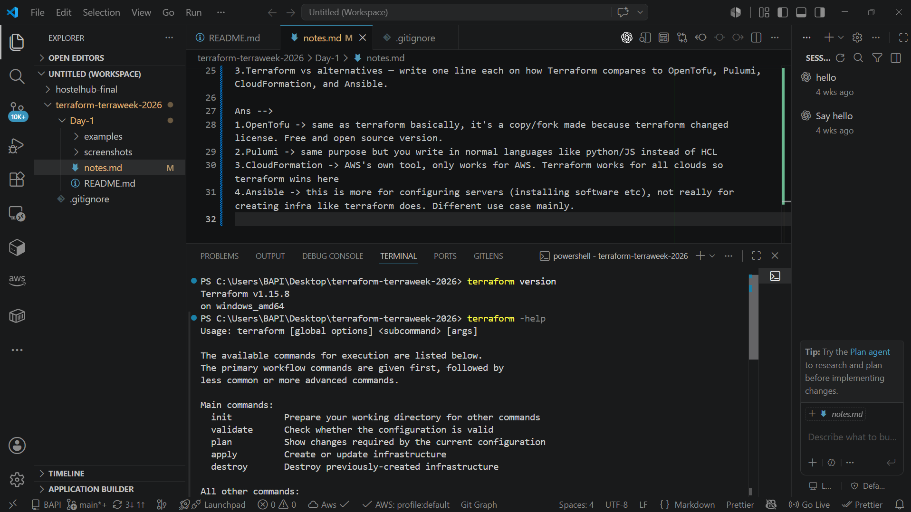
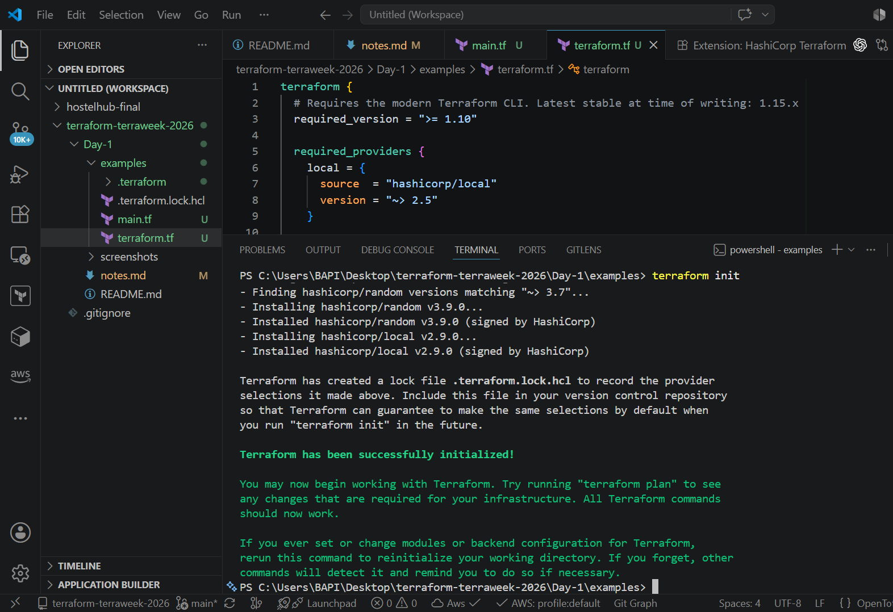
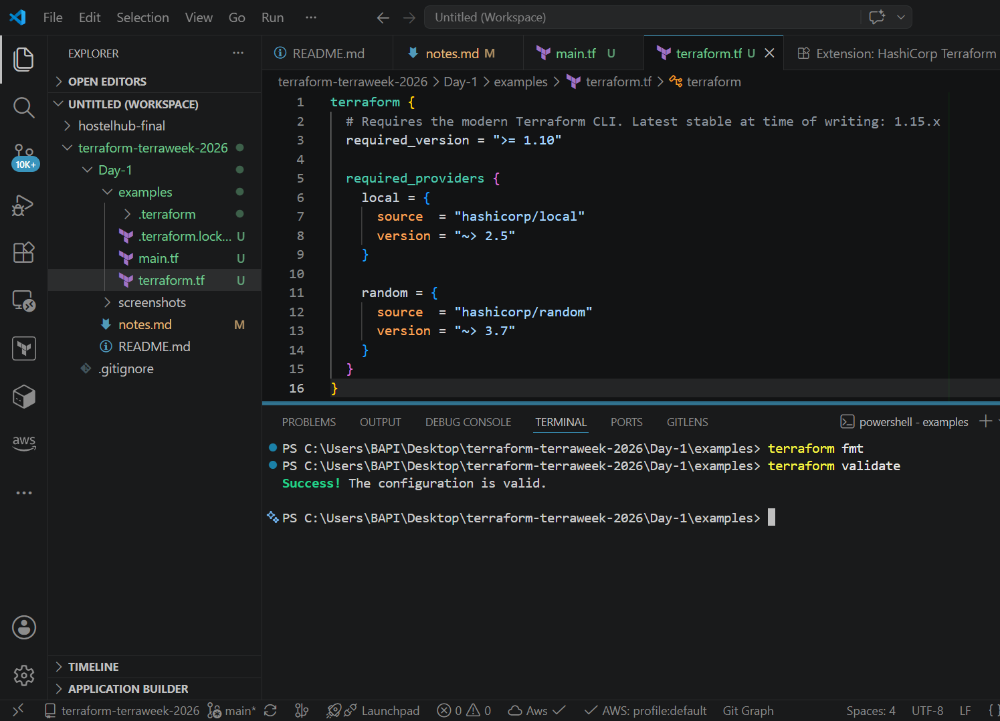
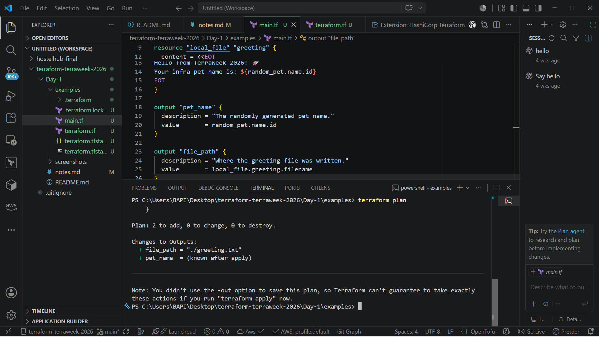
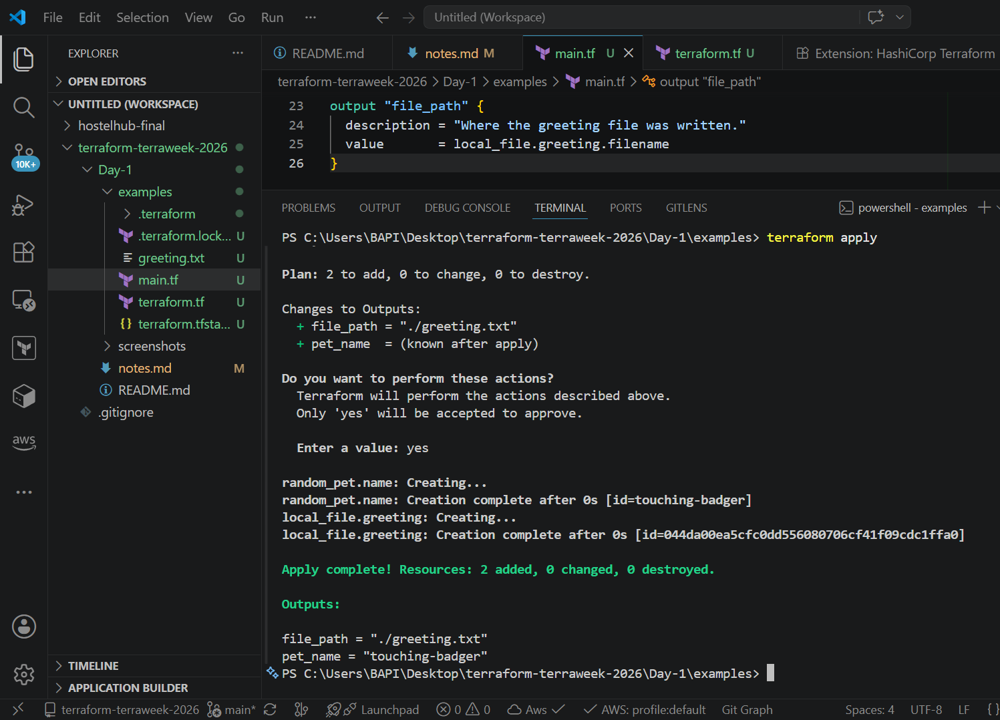
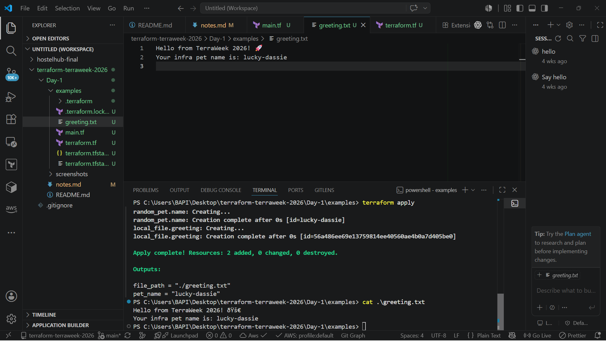
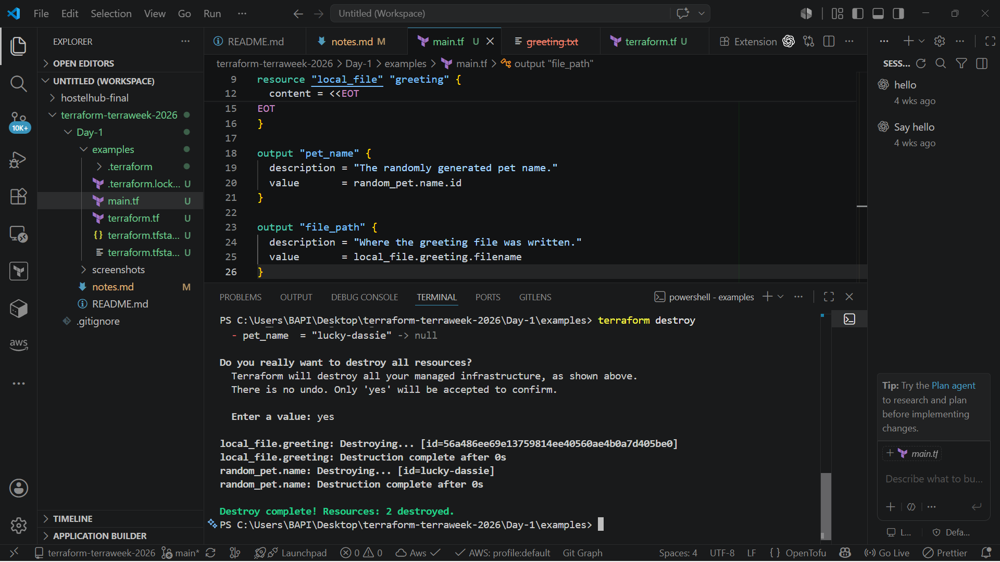

<div align="center">

# 🚀 TerraWeek Challenge 2026 — Day 1
### Introduction to Infrastructure as Code & Terraform Basics


*Part of the **TrainWithShubham TerraWeek Challenge 2026** — a 7-day hands-on journey into Terraform and Infrastructure as Code.*

</div>

---

## 📑 Table of Contents

- [Objective](#objective)
- [Learning Outcomes](#learning-outcomes)
- [Technologies Used](#technologies-used)
- [Project Structure](#project-structure)
- [Terraform Workflow](#terraform-workflow)
- [Commands Used](#commands-used)
- [Files Explained](#files-explained)
- [Screenshots](#screenshots)
- [Key Learnings](#key-learnings)
- [Interview Questions You Should Know](#interview-questions-you-should-know)
- [Best Practices Learned](#best-practices-learned)
- [Conclusion](#conclusion)

---

## Objective

Day 1 of the TerraWeek Challenge is focused on building a solid foundation before writing any real infrastructure code. The goal for this day was to understand **why Infrastructure as Code exists**, get comfortable with **Terraform's core vocabulary**, install the tooling correctly, and run the **complete Terraform workflow end-to-end** using a safe, cloud-free example (`local` + `random` providers) so no cloud account or billing was required.

---

## Learning Outcomes

By the end of Day 1, I was able to:

- Explain what Infrastructure as Code (IaC) is and why it's preferred over manually clicking through a cloud console
- Explain what Terraform is and why it has become the industry-standard IaC tool
- Compare Terraform against OpenTofu, Pulumi, AWS CloudFormation, and Ansible
- Install Terraform locally and verify the installation
- Set up the HashiCorp Terraform extension in VS Code for syntax highlighting and validation
- Define and give examples of six core Terraform concepts: **Provider, Resource, State, Plan, HCL, and Module**
- Run the full Terraform lifecycle — `init → fmt → validate → plan → apply → destroy` — on a real (if minimal) configuration

---

## Technologies Used

| Tool | Purpose |
|------|---------|
| **Terraform** | Core IaC tool used to define and provision infrastructure |
| **HCL** | Declarative language Terraform configuration is written in |
| **VS Code** + HashiCorp Terraform Extension | Editor with `.tf` syntax highlighting, formatting, and validation support |
| **Git** | Version control for tracking changes to the challenge repo |
| **GitHub** | Hosting the public TerraWeek Challenge submission |

---

## Project Structure

```text
Day-1/
│
├── README.md              # You are here
├── notes.md                # Raw personal notes for Tasks 1–4
├── example/
│   ├── terraform.tf        # Terraform + provider version constraints
│   └── main.tf              # random_pet and local_file resources
│
└── screenshots/            # CLI output screenshots for each step
```

---

## Terraform Workflow

Terraform follows a predictable, repeatable lifecycle every time infrastructure is created or changed:

```text
   Write
     ↓
    Init
     ↓
    Fmt
     ↓
  Validate
     ↓
    Plan
     ↓
   Apply
     ↓
  Destroy
```

| Step | What Happens |
|------|--------------|
| **Write** | Author the desired infrastructure in `.tf` files using HCL |
| **Init** | Download and initialize the providers referenced in the config |
| **Fmt** | Auto-format code to Terraform's canonical style |
| **Validate** | Check the configuration for syntax and internal consistency errors |
| **Plan** | Generate a dry-run showing exactly what will be added, changed, or destroyed |
| **Apply** | Execute the plan and provision the real resources |
| **Destroy** | Tear down every resource Terraform created, cleanly |

---

## Commands Used

| Command | Purpose |
|---------|---------|
| `terraform version` | Confirm the installed Terraform CLI version |
| `terraform -help` | List available Terraform subcommands and global options |
| `terraform init` | Initialize the working directory and download the `local` and `random` providers |
| `terraform fmt` | Rewrite `.tf` files into consistent, canonical formatting |
| `terraform validate` | Statically check the configuration for errors before planning |
| `terraform plan` | Preview the resources Terraform intends to create/change/destroy |
| `terraform apply` | Create the resources defined in the configuration |
| `cat greeting.txt` | Inspect the file Terraform generated via the `local_file` resource |
| `terraform destroy` | Remove all resources that Terraform created, returning to a clean state |

---

## Files Explained

### `terraform.tf`

```hcl
terraform {
  # Requires the modern Terraform CLI. Latest stable at time of writing: 1.15.x
  required_version = ">= 1.10"

  required_providers {
    local = {
      source  = "hashicorp/local"
      version = "~> 2.5"
    }

    random = {
      source  = "hashicorp/random"
      version = "~> 3.7"
    }
  }
}
```

| Block | Explanation |
|-------|-------------|
| `required_version` | Pins the minimum Terraform CLI version this config needs (`>= 1.10`), preventing use on an unsupported or older CLI |
| `required_providers` | Declares every provider the configuration depends on, along with its registry source and an acceptable version range |
| `local` provider | Manages resources on the local filesystem — used here to write the greeting file to disk |
| `random` provider | Generates random values with no external dependencies — used here to create the pet name |

### `main.tf`

```hcl
# Day 1 starter: no cloud account or credentials required.
# We generate a random pet name and write a greeting file locally.

resource "random_pet" "name" {
  length    = 2
  separator = "-"
}

resource "local_file" "greeting" {
  filename = "${path.module}/greeting.txt"

  content = <<EOT
Hello from TerraWeek 2026! 🚀
Your infra pet name is: ${random_pet.name.id}
EOT
}

output "pet_name" {
  description = "The randomly generated pet name."
  value       = random_pet.name.id
}

output "file_path" {
  description = "Where the greeting file was written."
  value       = local_file.greeting.filename
}
```

| Block | Explanation |
|-------|-------------|
| `random_pet.name` | Generates a random, hyphen-separated two-word identifier (e.g. `witty-badger`) via the `separator` argument |
| `local_file.greeting` | Writes `greeting.txt` to disk using a heredoc (`<<EOT ... EOT`) so the content can span multiple lines cleanly |
| `output "pet_name"` | Prints the generated pet name in the CLI after `apply`; the `description` field documents what the output represents |
| `output "file_path"` | Prints the full path of the created file after `apply` |

---

## Screenshots

> Screenshots captured from my own terminal while running each command.










---

## Key Learnings

- IaC isn't just "automation for automation's sake" — its real value is **eliminating configuration drift** between environments and making infrastructure changes reviewable, like application code
- Terraform's **plan-before-apply** model is what makes it safe to use in real teams — nothing changes silently
- **State** is the piece most tutorials gloss over, but it's genuinely the mechanism that lets Terraform know what already exists without re-scanning the entire cloud account every run
- Providers are what make Terraform's "one tool, every platform" pitch actually work — the core Terraform engine has no built-in knowledge of AWS, Docker, or anything else; that all comes from providers
- Even a config with zero cloud resources (just `local` + `random`) is enough to internalize the full `init → apply → destroy` habit loop before touching real infrastructure and real cost

---

## Interview Questions You Should Know

<details>
<summary><strong>Click to expand: 10 Beginner Terraform Interview Questions</strong></summary>

**1. What is Terraform?**
An open-source Infrastructure as Code tool that lets you define, provision, and manage infrastructure across multiple cloud and on-prem platforms using a declarative configuration language (HCL).

**2. What is the difference between Terraform and Ansible?**
Terraform is primarily a declarative provisioning tool focused on creating and managing infrastructure state; Ansible is primarily an imperative configuration-management tool focused on installing and configuring software on existing servers.

**3. What is a provider in Terraform?**
A plugin that translates Terraform's generic resource blocks into API calls for a specific platform (e.g., AWS, Azure, Docker, GitHub), enabling Terraform to manage resources there.

**4. What is Terraform state, and why is it important?**
A file (`terraform.tfstate`) where Terraform records the resources it currently manages and their attributes. It's how Terraform maps your configuration to real-world objects and calculates what needs to change on the next run.

**5. What is the difference between `terraform plan` and `terraform apply`?**
`plan` computes and displays the changes Terraform *would* make without touching any infrastructure; `apply` actually executes those changes.

**6. What is a Terraform module?**
A reusable, self-contained package of `.tf` configuration that can be called multiple times with different input variables, avoiding duplicated code across environments.

**7. What happens if you delete the `terraform.tfstate` file?**
Terraform loses track of what it previously created. On the next run it will see no existing resources and may try to recreate everything, potentially causing duplicate resources or orphaning the originals.

**8. What is HCL?**
HashiCorp Configuration Language — the declarative, human-readable syntax used to write Terraform configuration files (`.tf`).

**9. Why should `.terraform.lock.hcl` be committed to version control?**
It records the exact provider versions used, ensuring every teammate and CI pipeline gets identical provider behavior instead of silently drifting to newer versions.

**10. What is the purpose of `terraform destroy`?**
It removes every resource Terraform is currently tracking in state, cleanly tearing down infrastructure — essential for avoiding leftover cost in practice/sandbox environments.

</details>

---

## Best Practices Learned

- ✅ Always run `terraform fmt` before committing — keep code style consistent across the team
- ✅ Always review `terraform plan` output carefully before applying, even for "small" changes
- ✅ Never skip `terraform destroy` in practice labs — untracked resources quietly cost money
- ✅ Commit `.terraform.lock.hcl` to version control for reproducible provider versions
- 🚫 Ignore `.terraform/` (and `*.tfstate` locally) in `.gitignore` — it's local, regenerable, and can contain sensitive data

```gitignore
.terraform/
*.tfstate
*.tfstate.backup
crash.log
```

---

## Conclusion

Day 1 laid the groundwork for the rest of the TerraWeek Challenge — not by jumping straight into cloud resources, but by making sure the fundamentals of **why IaC matters**, **how Terraform's workflow operates**, and **what its core building blocks mean** were properly understood first. Running the full `init → apply → destroy` cycle on a zero-cost, zero-credential example made the workflow tangible without any risk. With this foundation in place, Day 2 onward will build toward real provider configurations and actual cloud infrastructure.

---

<div align="center">

**🔗 Part of the TrainWithShubham TerraWeek Challenge 2026**

⭐ If you're also doing this challenge, feel free to fork and follow along!

</div>