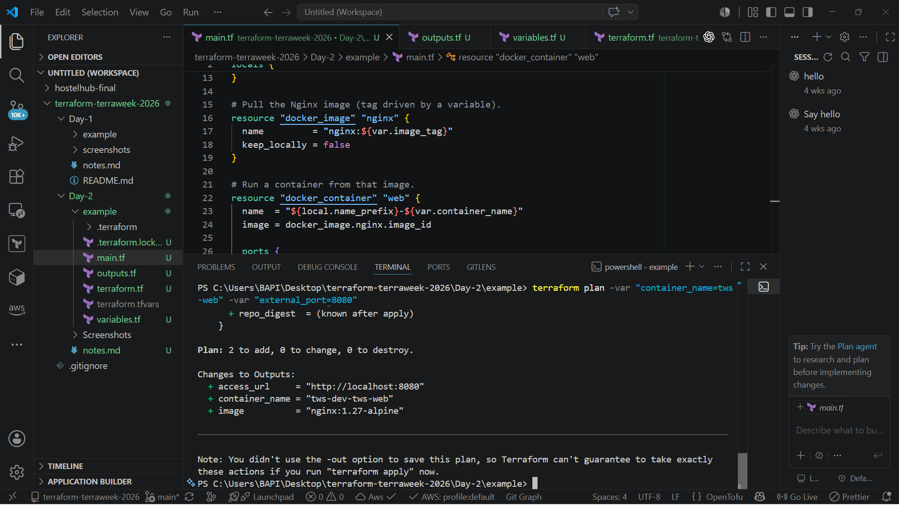
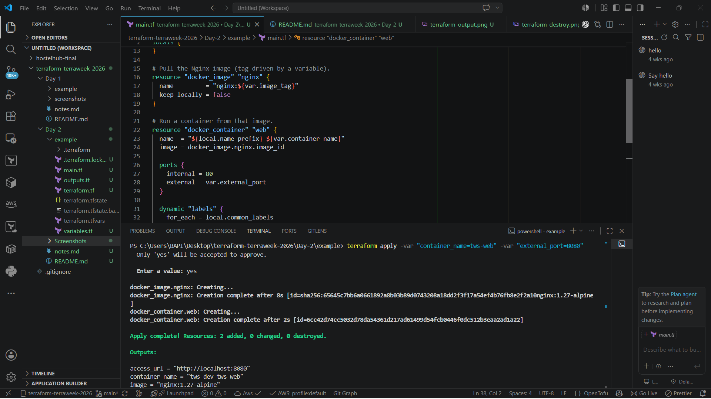
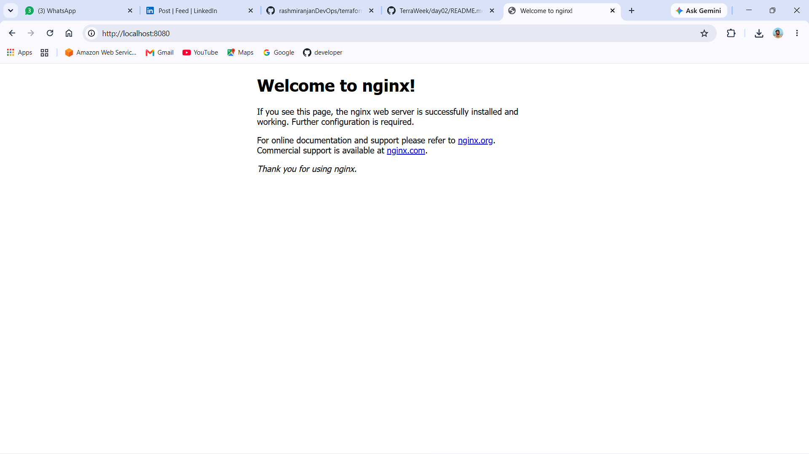
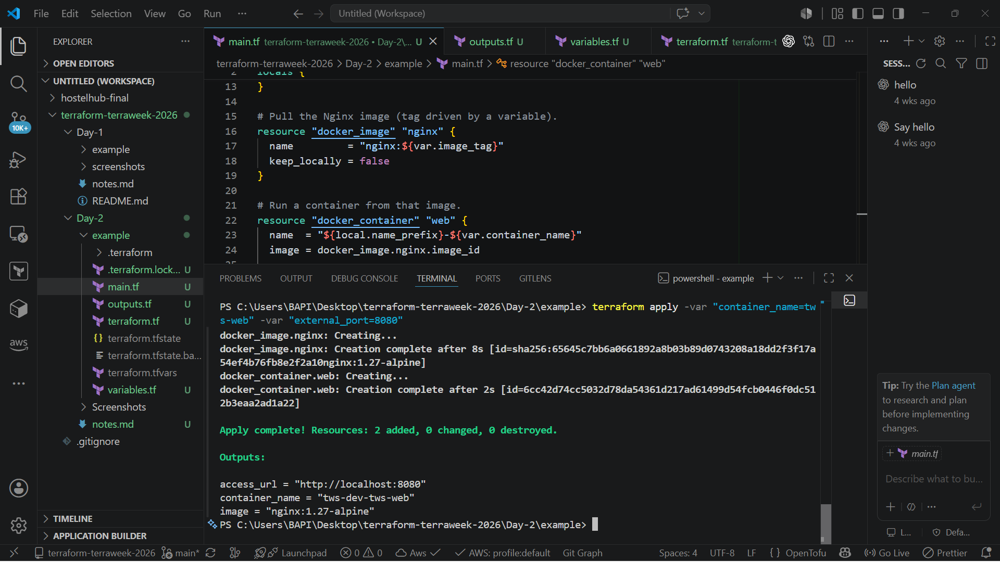
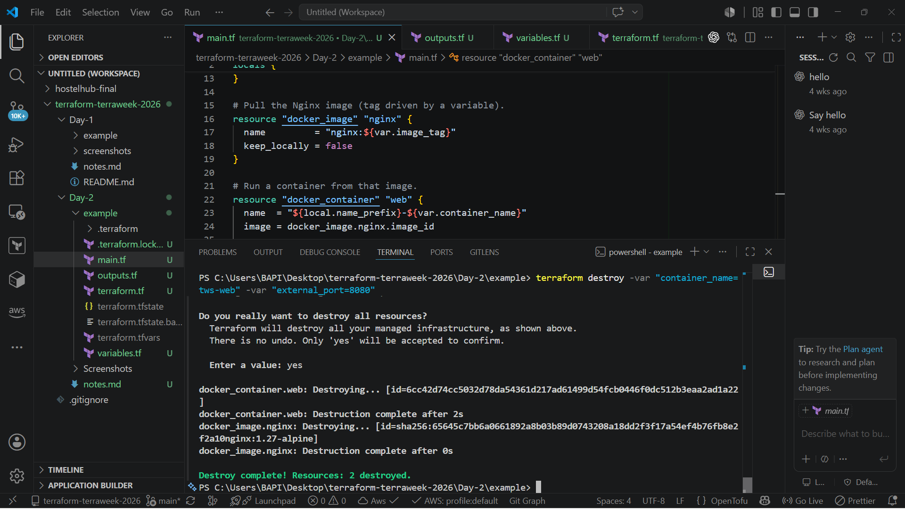

<div align="center">

# 🚀 TerraWeek Challenge 2026 — Day 2
### HCL Deep Dive: Variables, Types & Expressions


*Part of the **TrainWithShubham TerraWeek Challenge 2026** — a 7-day hands-on journey into Terraform and Infrastructure as Code.*

</div>

---

## 📑 Table of Contents

- [Objective](#objective)
- [Learning Outcomes](#learning-outcomes)
- [Technologies Used](#technologies-used)
- [Project Structure](#project-structure)
- [Task 1 — HCL Syntax](#task-1--hcl-syntax)
- [Task 2 — Variables](#task-2--variables)
- [Task 3 — Locals, Outputs & Functions](#task-3--locals-outputs--functions)
- [Task 4 — Docker Project](#task-4--docker-project)
- [Variable Precedence](#variable-precedence)
- [-var vs terraform.tfvars](#-var-vs-terraformtfvars)
- [Screenshots](#screenshots)
- [Best Practices Learned](#best-practices-learned)
- [Interview Questions You Should Know](#interview-questions-you-should-know)
- [Key Learnings](#key-learnings)
- [Conclusion](#conclusion)

---

## Objective

Day 1 covered *why* Terraform exists and what its core vocabulary means. Day 2 goes one level deeper into **HCL itself** — how to actually write configuration that's readable, reusable, and safe. That means variables with real types and validation, computed values via `locals`, exposing results via `outputs`, working with built-in functions, understanding how Terraform resolves conflicting variable sources, and — for the first time this week — provisioning something that actually runs: an Nginx container via the Docker provider. Still zero cloud cost, but a real, running piece of infrastructure.

---

## Learning Outcomes

By the end of Day 2, I was able to:

- Break down the anatomy of an HCL block and explain the difference between an argument and a block
- Write and read HCL expressions: string interpolation, references, operators, and function calls
- Declare Terraform variables across all three type categories — primitive, collection, and structural
- Add `default`, `validation`, and `sensitive` to variables, and explain what each protects against
- Use `locals` to compute derived values instead of repeating expressions across a config
- Expose useful values with `output` blocks
- Use built-in functions (`merge`, `join`, `upper`, `length`, `lookup`) and test them live with `terraform console`
- Explain Terraform's variable precedence order, from CLI flags down to defaults
- Provision a real (if local) piece of infrastructure — an Nginx container — using the Docker provider, variables, and `terraform.tfvars`

---

## Technologies Used

| Tool | Purpose |
|------|---------|
| **Terraform** | Core IaC tool used to define and provision infrastructure |
| **HCL** | Declarative language Terraform configuration is written in |
| **Docker** | Local container runtime — today's "infrastructure" target, no cloud needed |
| **VS Code** + HashiCorp Terraform Extension | Editor with `.tf` syntax highlighting, formatting, and validation support |
| **Git** | Version control for tracking changes to the challenge repo |
| **GitHub** | Hosting the public TerraWeek Challenge submission |

---

## Project Structure

```text
Day-2/
│
├── README.md                    # You are here
├── notes.md                     # Raw personal notes for Tasks 1–4
├── example/
│   ├── terraform.tf             # Terraform + provider version constraints
│   ├── variables.tf             # All variable types + validation + sensitive
│   ├── locals.tf                # Computed values and function usage
│   ├── outputs.tf               # Exposed values, incl. the running container
│   ├── main.tf                  # The actual Docker + Nginx resources
│   ├── terraform.tfvars         # Real values for this run (gitignored)
│   └── terraform.tfvars.example # Committable template of the above
│
└── screenshots/                 # CLI output screenshots for each step
```

---

## Task 1 — HCL Syntax

### Anatomy of a Block

Every piece of Terraform configuration follows the same shape:

```hcl
block_type "label_one" "label_two" {
  argument = value
}
```

| Part | Meaning |
|------|---------|
| **Block type** | What kind of thing is being defined — `resource`, `variable`, `provider`, `output`, etc. |
| **Labels** | Identifiers for that block. A `resource` block takes two labels (type + name); a `variable` block takes one; a `provider` block can take none |
| **Body `{ }`** | Everything inside is the set of arguments (and possibly nested blocks) that configure it |

```hcl
resource "docker_container" "nginx" {
  name  = "terraweek-dev"
  image = docker_image.nginx.image_id
}
```

Here `resource` is the block type, `docker_container` is the first label (the resource type), and `nginx` is the second label (the local name used to reference it elsewhere, e.g. `docker_container.nginx`).

### Argument vs Block

An **argument** is a single `key = value` line — it assigns exactly one value, and that value can itself be a string, number, bool, list, map, object, or expression.

A **block** has its own `{ }` body instead of a value after the `=` sign. Blocks can contain more arguments or further nested blocks, and some block types can repeat multiple times inside the same parent block.

```hcl
resource "docker_container" "nginx" {
  name  = "terraweek-dev"          # argument — single value

  ports {                          # nested block — has its own body,
    internal = 80                  # can repeat if more port mappings
    external = 8080                # are needed
  }
}
```

### Expressions

| Type | What it does | Example |
|------|---------------|---------|
| **String interpolation** | Embeds a reference inside a larger string using `${...}` | `"Container: ${docker_container.nginx.name}"` |
| **References** | Dot notation pointing to another value | `var.image_name`, `local.name_prefix`, `docker_container.nginx.id` |
| **Operators** | Arithmetic, comparison, and logical operators, plus the ternary conditional | `var.instance_count + 1`, `var.environment == "prod"`, `var.enabled ? "on" : "off"` |
| **Function calls** | Built-in functions applied to a value | `upper(var.project_name)`, `merge(var.a, var.b)` |

In modern Terraform, `${ }` is only required when mixing a reference into a larger string. A standalone reference doesn't need it — `image_name = var.image_name` is correct; `image_name = "${var.image_name}"` is redundant and will trigger a linting warning from `terraform fmt`/`validate` style checks.

---

## Task 2 — Variables

All variables live in [`example/variables.tf`](example/variables.tf), grouped by category:

### Primitive Types

```hcl
variable "project_name" {
  description = "Name of the project, used as a prefix for resource naming"
  type        = string
  default     = "terraweek"
}

variable "instance_count" {
  description = "Number of instances to create"
  type        = number
  default     = 2
}

variable "enable_monitoring" {
  description = "Whether to enable detailed monitoring on resources"
  type        = bool
  default     = true
}
```

### Collection Types

```hcl
variable "availability_zones" {
  description = "List of availability zones to deploy resources into"
  type        = list(string)
  default     = ["us-east-1a", "us-east-1b"]
}

variable "common_tags" {
  description = "Common tags applied to every resource"
  type        = map(string)
  default = {
    Owner       = "terraweek"
    Environment = "dev"
  }
}

variable "allowed_ports" {
  description = "Set of ports allowed through the security group"
  type        = set(string)
  default     = ["22", "80", "443"]
}
```

`list` preserves order and allows duplicates. `set` is unordered and silently drops duplicates. `map` requires every value to share the same type.

### Structural Types

```hcl
variable "server_config" {
  description = "Configuration object describing the server to create"
  type = object({
    name     = string
    size     = string
    replicas = number
  })
  default = {
    name     = "web-server"
    size     = "t2.micro"
    replicas = 1
  }
}

variable "instance_spec" {
  description = "Fixed-shape tuple: [name, cpu_count, is_spot_instance]"
  type        = tuple([string, number, bool])
  default     = ["app-node", 2, false]
}
```

An `object` has named attributes that can each have a different type. A `tuple` has a fixed length with a specific type defined per position — unlike a `list`, which is any length but a single type throughout.

### Default, Validation & Sensitive

```hcl
variable "environment" {
  description = "Deployment environment"
  type        = string
  default     = "dev"

  validation {
    condition     = contains(["dev", "staging", "prod"], var.environment)
    error_message = "environment must be one of: dev, staging, prod."
  }
}

variable "db_password" {
  description = "Database password. Marked sensitive so it never shows in plan/apply output or logs."
  type        = string
  sensitive   = true
  # intentionally no default — sensitive values should come from tfvars, env vars, or a secrets manager
}
```

`validation` rejects bad input at plan time instead of letting it silently create the wrong resource — cheaper to catch a typo here than after `apply`. `sensitive = true` hides the value from `plan`/`apply`/`console` output and forces any output derived from it to be marked sensitive too, which matters the moment this repo has more than one contributor.

---

## Task 3 — Locals, Outputs & Functions

### Locals

```hcl
locals {
  name_prefix = "${var.project_name}-${var.environment}"

  common_tags = merge(
    var.common_tags,
    {
      Name      = local.name_prefix
      ManagedBy = "terraform"
    }
  )

  az_list_joined      = join(", ", var.availability_zones)
  project_name_upper  = upper(var.project_name)
  az_count            = length(var.availability_zones)
  owner_tag           = lookup(var.common_tags, "Owner", "unknown")
}
```

Without `locals`, `"${var.project_name}-${var.environment}"` would end up copy-pasted into every resource that needs a name — and every tag map would be rebuilt from scratch. `locals` computes it once; every resource just references `local.name_prefix`.

### Outputs

```hcl
output "container_name" {
  description = "Name of the running Nginx container"
  value       = docker_container.nginx.name
}

output "container_url" {
  description = "URL where Nginx is reachable on the host"
  value       = "http://localhost:${var.external_port}"
}
```

Outputs surface values after `apply` — either as human-readable confirmation in the terminal, or as data a parent module could consume if this were called as a module elsewhere. The full set of outputs is in [`example/outputs.tf`](example/outputs.tf).

### Built-in Functions

| Function | What it does | Used for |
|----------|---------------|----------|
| `merge()` | Combines two or more maps into one | Layering computed tags on top of the base `common_tags` |
| `join()` | Concatenates a list into a single string with a separator | Turning the AZ list into one readable string |
| `upper()` | Uppercases a string | Display-friendly project name |
| `length()` | Counts elements in a list/map/string | Counting how many AZs are in use |
| `lookup()` | Reads a map value by key, with a fallback if missing | Safely reading the `Owner` tag without erroring if it's absent |

### Terraform Console

```bash
terraform console
> local.name_prefix
> local.common_tags
> lookup(var.common_tags, "Team", "unknown")
```

`terraform console` is a read-only REPL — it evaluates expressions against the current variables and state without ever touching real infrastructure. It's the fastest way to sanity-check a function or expression before wiring it into a resource.

---

## Task 4 — Docker Project

The final piece ties Tasks 2 and 3 together into something real: an Nginx container, named using the `local.name_prefix` computed earlier.

```hcl
resource "docker_image" "nginx" {
  name = var.image_name
}

resource "docker_container" "nginx" {
  name  = local.name_prefix
  image = docker_image.nginx.image_id

  ports {
    internal = 80
    external = var.external_port
  }
}
```

### Commands Used

| Command | Purpose |
|---------|---------|
| `terraform init` | Download the `docker` provider and initialize the working directory |
| `terraform plan` | Preview the image pull and container creation before touching anything |
| `terraform apply` | Pull the Nginx image and start the container |
| `terraform output` | Print the `container_name` and `container_url` values without re-running apply |
| `terraform destroy` | Stop and remove the container, cleaning up completely |

### Using `-var` vs `terraform.tfvars`

Both ways of overriding `external_port` for one run:

```bash
# One-off override on the command line
terraform apply -var="external_port=9090"

# Or: set it once in terraform.tfvars and just run
terraform apply
```

Terraform automatically loads a file named exactly `terraform.tfvars` on every run — no flag required. `-var` is for a value you want to change *just this once* without editing a file.

---

## Variable Precedence

When the same variable is set in more than one place, Terraform resolves it in a fixed order:

```text
      -var
       ↓
   -var-file
       ↓
 *.auto.tfvars
       ↓
terraform.tfvars
       ↓
    TF_VAR_
       ↓
    default
```

| Rank | Source | Notes |
|------|--------|-------|
| 1 (highest) | `-var` / `-var-file` on the CLI | Explicit, in-the-moment overrides — win over every other source |
| 2 | `*.auto.tfvars` / `*.auto.tfvars.json` | Auto-loaded, evaluated in alphabetical filename order |
| 3 | `terraform.tfvars` / `terraform.tfvars.json` | The conventional vars file, auto-loaded without any flag |
| 4 | `TF_VAR_<name>` environment variables | Handy for CI/CD pipelines and shell-level secrets |
| 5 (lowest) | `default` in the `variable` block | Only used if nothing above sets a value |

The logic: the source closest to the person actually running the command (a CLI flag typed right now) should win over something set further away and further in advance (a default written weeks ago).

---

## `-var` vs `terraform.tfvars`

| Aspect | `-var` (CLI flag) | `terraform.tfvars` (file) |
|--------|-------------------|----------------------------|
| **Ease of use** | Fast for a single override, tedious for many variables | Set once, reused on every run automatically |
| **Automation** | Good when a script is already building flags dynamically | Good when config should be reviewed as one unit |
| **CI/CD** | Common for injecting per-run secrets or dynamic values | Common for injecting stable, per-environment config |
| **Readability** | Gets messy fast with more than a couple of variables | One file, easy to scan and diff in a PR |
| **Best use case** | Temporary overrides, quick testing, one-off secrets | Long-lived, shared, repeatable configuration |
| **Production recommendation** | Reserve for secrets/ephemeral values, ideally via env vars or a secrets manager rather than typed by hand | Commit non-secret `.tfvars`; keep secret-holding `.tfvars` files gitignored |

---

## Screenshots

> Screenshots captured from my own terminal while running each command.

<!--  -->





<!--  -->

---

## Best Practices Learned

- ✅ Keep variables reusable — generic enough to work across environments, not hardcoded per resource
- ✅ Use `validation` blocks to catch bad input before it reaches `apply`
- ✅ Keep secrets marked `sensitive`, and never give them a hardcoded default
- ✅ Use `locals` to compute a value once instead of repeating the same expression everywhere
- ✅ Prefer `terraform.tfvars` for values that repeat across runs; reserve `-var` for one-off overrides
- ✅ Always review `terraform plan` output before running `apply`
- ✅ Destroy resources after every practice session — including local Docker containers
- ✅ Commit `.terraform.lock.hcl` for reproducible provider versions
- 🚫 Ignore `.terraform/` and any `.tfvars` file that holds real secrets

---

## Interview Questions You Should Know

<details>
<summary><strong>Click to expand: Top 15 Terraform Interview Questions — Day 2</strong></summary>

**1. What is HCL, and why does Terraform use it?**
HashiCorp Configuration Language — a declarative, human-readable syntax purpose-built for describing infrastructure, easier to read and write than raw JSON while still being fully machine-parseable.

**2. What is the difference between an argument and a block?**
An argument is a single `key = value` setting. A block has its own `{ }` body containing further arguments or nested blocks, and some block types can repeat.

**3. How do you declare a Terraform variable?**
With a `variable "name" { }` block, optionally specifying `type`, `default`, `description`, `validation`, and `sensitive`. It's referenced elsewhere as `var.name`.

**4. What are Terraform's three primitive types?**
`string`, `number`, and `bool`.

**5. What's the difference between a `list` and a `set`?**
A `list` preserves order and allows duplicate values. A `set` is unordered and automatically removes duplicates.

**6. What's the difference between a `map` and an `object`?**
A `map` requires every value to share the same type. An `object` defines a fixed set of named attributes, each of which can have its own type.

**7. What's the difference between a `list` and a `tuple`?**
A `list` can be any length but holds one consistent type. A `tuple` has a fixed length with a specific type defined for each position.

**8. What does `sensitive = true` do?**
Hides the variable's value from CLI output (`plan`, `apply`, `console`) and forces any output derived from it to also be marked sensitive, reducing the chance of it leaking into logs.

**9. Why do `validation` blocks matter for production infrastructure?**
They reject invalid input at plan time — before anything is created — instead of letting a typo silently produce a misconfigured or broken resource.

**10. What's the difference between a `local` and a `variable`?**
A `variable` is external input the caller can set. A `local` is a value computed inside the config from expressions or variables, and cannot be set from outside.

**11. What's the purpose of an `output` block?**
It exposes a value after `apply` — either as readable confirmation in the terminal, or as data a parent module can consume.

**12. Name three built-in Terraform functions and what they do.**
`merge()` combines maps; `join()` concatenates a list into a string; `length()` counts elements in a list, map, or string.

**13. What is `terraform console` used for?**
An interactive, read-only REPL for testing expressions and functions against the current variables and state, without touching real infrastructure.

**14. What is Terraform's variable precedence order?**
From highest to lowest: `-var` / `-var-file` on the CLI → `*.auto.tfvars` → `terraform.tfvars` → `TF_VAR_` environment variables → the `default` in the variable block.

**15. What's the difference between `-var` and a `terraform.tfvars` file?**
`-var` is a one-off CLI override, good for quick tests or CI-injected secrets. `terraform.tfvars` is auto-loaded on every run, better for stable, shared, reviewable configuration.

</details>

---

## Key Learnings

- Variables aren't just "inputs" — `type`, `validation`, and `sensitive` turn them into a contract that catches mistakes early instead of after something's already been created
- `locals` earn their keep the moment the same expression would otherwise be typed more than once
- Functions like `merge()` and `lookup()` make tag management genuinely simpler instead of hand-writing merged maps
- `terraform console` turned out to be the fastest feedback loop this week — testing a function takes seconds instead of a full `plan`
- Understanding variable precedence removed a lot of confusion about why a value wasn't "taking" — it usually meant something higher up the chain (a stray `-var`, an `.auto.tfvars` file) was quietly winning

---

## Conclusion

Day 2 moved from *knowing what Terraform is* to *actually writing HCL with intent* — typed variables instead of loose strings, computed locals instead of repeated expressions, and a real (if local) Nginx container instead of just a text file. Understanding variable precedence and the `-var` vs `terraform.tfvars` trade-off also matters more than it looks on the surface — it's the difference between config that behaves predictably in a team and one that "works on my machine." Heading into Day 3 with a much better handle on how to structure Terraform code that other people (or future me) can actually read.

---

<div align="center">

**🔗 Part of the TrainWithShubham TerraWeek Challenge 2026**

⭐ If you're also doing this challenge, feel free to fork and follow along!

</div>