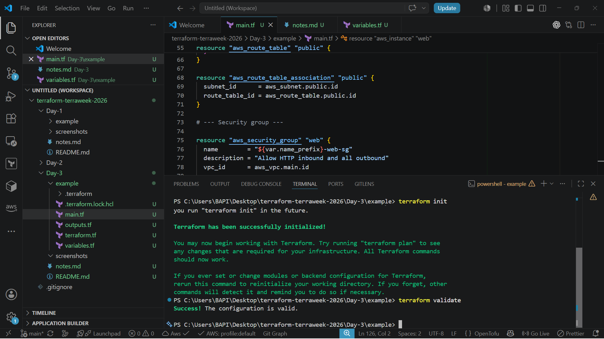
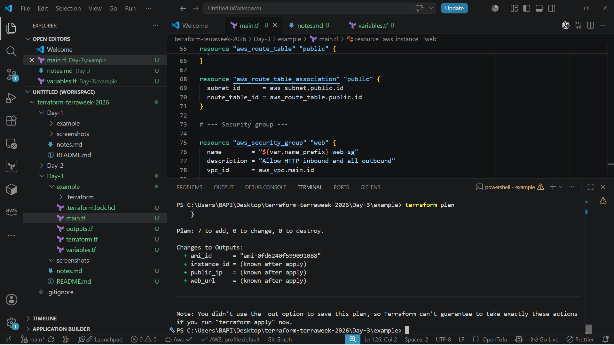
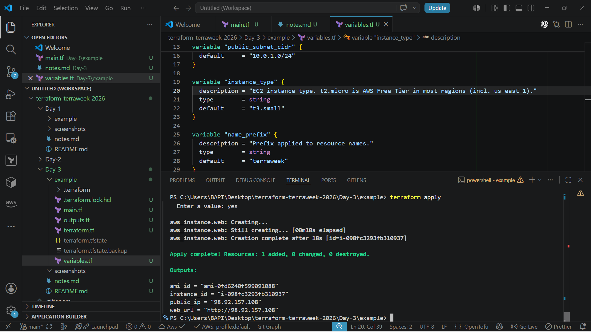
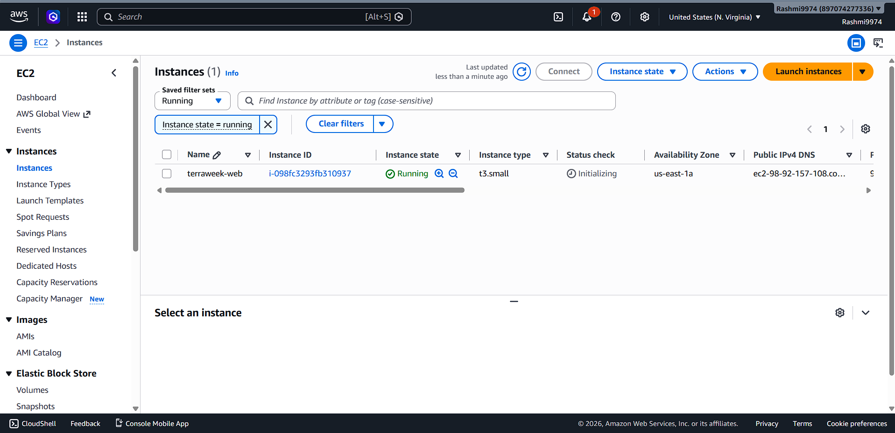
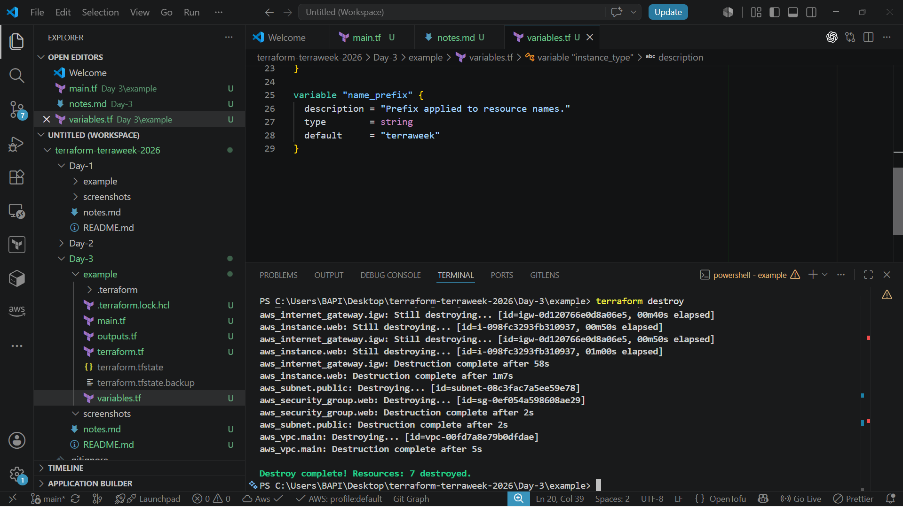
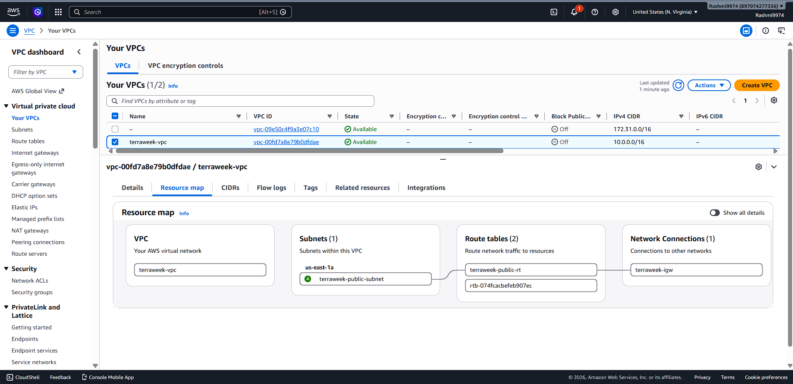

# Day 3 – Provisioning AWS Infrastructure with Terraform

**TerraWeek Challenge 2026** · Organized by TrainWithShubham

[](https://www.terraform.io/)
[](https://aws.amazon.com/)
[]()

---

## 📌 Project Overview

Day 3 of the TerraWeek Challenge moves from theory into hands-on infrastructure provisioning. This module focuses on using Terraform to build **real, working AWS infrastructure** — not just isolated resource blocks — while covering the concepts needed to write production-grade Terraform code.

The core focus areas for this day are:

- **Providers** – configuring Terraform to authenticate and communicate with AWS
- **Version Pinning** – locking provider and Terraform CLI versions for predictable, repeatable builds
- **Resources vs Data Sources** – understanding what Terraform creates versus what it only reads
- **Meta Arguments** – `count`, `for_each`, `depends_on`, and `lifecycle` for flexible resource management
- **AWS Networking** – VPC, subnets, gateways, route tables, and security groups working together
- **Infrastructure Lifecycle** – the full loop of plan → apply → inspect → destroy

By the end of this module, a complete networking stack with a running EC2 instance is provisioned entirely through Terraform, using a dynamically fetched AMI rather than a hardcoded one.

---

## 🎯 Learning Objectives

- [x] Configure the Terraform AWS provider with proper authentication
- [x] Apply version pinning to Terraform and provider versions
- [x] Understand the distinction between resources and data sources
- [x] Provision a functioning AWS networking stack (VPC → EC2)
- [x] Apply meta arguments to control resource creation behavior
- [x] Update infrastructure safely using `terraform plan`
- [x] Destroy infrastructure cleanly to avoid unnecessary AWS costs

---

## 🏗️ AWS Architecture

```text
                    Internet
                       │
                       ▼
              Internet Gateway (IGW)
                       │
                       ▼
                  Route Table
              (0.0.0.0/0 → IGW)
                       │
                       ▼
                 Public Subnet
                       │
                       ▼
                Security Group
           (SSH: 22, HTTP: 80 allowed)
                       │
                       ▼
                  EC2 Instance
              (Amazon Linux 2023)
                       │
                       ▼
                    Inside VPC
```

**How it works:** Traffic from the internet enters the VPC only through the Internet Gateway — this is the single authorized entry/exit point. The Route Table determines that any traffic destined for `0.0.0.0/0` should be routed through the IGW, and this route is associated with the Public Subnet, which is what makes the subnet "public" in practice. Once inside the subnet, traffic reaches the EC2 instance only if it passes the Security Group rules, which act as an instance-level firewall permitting only specific ports (SSH and HTTP in this setup). The entire stack lives inside a single VPC, isolated from any other AWS account or network.

---

## 🧱 AWS Infrastructure Created

| Resource | Purpose |
|---|---|
| **VPC** | Isolated network boundary for all resources in this project |
| **Public Subnet** | Hosts the EC2 instance and is reachable from the internet |
| **Internet Gateway** | Provides the VPC with an entry/exit point to the internet |
| **Route Table** | Routes outbound traffic (`0.0.0.0/0`) through the Internet Gateway |
| **Route Table Association** | Binds the route table to the public subnet, making it public |
| **Security Group** | Controls inbound/outbound traffic to the EC2 instance (SSH, HTTP) |
| **EC2 Instance** | The compute resource running inside the public subnet |
| **Amazon Linux 2023 AMI (Data Source)** | Dynamically fetches the latest AMI ID instead of hardcoding it |

---

## 📂 Project Structure

```text
Day-3/
│
├── README.md
├── notes.md
├── example/
│   ├── provider.tf
│   ├── variables.tf
│   ├── network.tf
│   ├── security.tf
│   ├── ec2.tf
│   ├── outputs.tf
│   ├── terraform.tfvars
│   └── terraform.tfvars.example
│
└── Screenshots/
```

> Note: adjust this tree if your actual file names differ — the structure above reflects the recommended separation of concerns (networking, security, and compute kept in dedicated files rather than one large `main.tf`).

---

## 📄 Terraform Files Overview

| File | Purpose |
|---|---|
| `provider.tf` | Declares the required Terraform version, required providers, and AWS provider configuration (region) |
| `variables.tf` | Defines input variables (region, instance type, CIDR blocks, tags) with sensible defaults |
| `network.tf` | Defines the VPC, public subnet, Internet Gateway, route table, and route table association |
| `security.tf` | Defines the Security Group and its inbound/outbound rules |
| `ec2.tf` | Defines the `aws_ami` data source and the `aws_instance` resource |
| `outputs.tf` | Exposes useful values after apply — instance public IP, VPC ID, subnet ID |
| `terraform.tfvars` | Actual variable values used for this deployment (not committed with secrets) |
| `terraform.tfvars.example` | Template showing which variables need to be set, safe to commit |

---

## ⚙️ Terraform Workflow

| Command | Purpose |
|---|---|
| `terraform init` | Downloads the required providers and initializes the working directory |
| `terraform validate` | Checks the configuration syntax and internal consistency without touching real infra |
| `terraform plan` | Shows exactly what will be created, changed, or destroyed before anything happens |
| `terraform apply` | Executes the plan and provisions the actual AWS resources |
| `terraform state list` | Lists every resource currently tracked in the Terraform state file |
| `terraform destroy` | Tears down every resource managed by this configuration, cleanly and in the correct order |

---

## 🔌 Providers & Version Pinning

**Provider** – a plugin that allows Terraform to communicate with a specific platform (in this case, AWS). Terraform's core has no built-in knowledge of any cloud; the provider translates configuration into real API calls.

```hcl
terraform {
  required_version = ">= 1.6.0"

  required_providers {
    aws = {
      source  = "hashicorp/aws"
      version = "~> 5.0"
    }
  }
}

provider "aws" {
  region = var.aws_region
}
```

- **`required_version`** – enforces a minimum Terraform CLI version, preventing syntax or behavior mismatches across team members.
- **`required_providers`** – declares which providers this configuration depends on.
- **`source`** – the registry path the provider is downloaded from (`namespace/provider-name`).
- **`version`** – the acceptable version range for that provider.

**Version Pinning** locks provider behavior so an unexpected upgrade doesn't silently break the configuration. `~> 5.0` (the pessimistic constraint operator) allows updates within the 5.x line but blocks a jump to 6.0, striking a balance between staying current and staying stable.

**Provider Alias** allows multiple configurations of the same provider — commonly used for multi-region or multi-account deployments, such as running primary infrastructure in one region with a disaster-recovery copy in another. Full explanation and examples are in `notes.md`.

---

## 🔍 Resources vs Data Sources

| | Resource | Data Source |
|---|---|---|
| **Purpose** | Create and manage infrastructure | Read existing information |
| **Creates Infrastructure** | ✅ Yes | ❌ No |
| **Reads Existing Infrastructure** | Reads its own managed state | ✅ Yes, always |
| **Managed by Terraform** | ✅ Fully owned and tracked | ❌ Not owned, read-only |
| **Examples** | `aws_vpc`, `aws_instance`, `aws_security_group` | `aws_ami`, `aws_availability_zones`, `aws_vpc` (default lookup) |

In this project, the EC2 instance uses a `data "aws_ami"` block to fetch the latest **Amazon Linux 2023** AMI ID for the deployment region at apply time, instead of hardcoding an AMI ID that would go stale or fail in a different region.

```hcl
data "aws_ami" "amazon_linux" {
  most_recent = true
  owners      = ["amazon"]

  filter {
    name   = "name"
    values = ["al2023-ami-*-x86_64"]
  }
}

resource "aws_instance" "web" {
  ami           = data.aws_ami.amazon_linux.id
  instance_type = var.instance_type
  subnet_id     = aws_subnet.public.id
}
```

---

## 🧩 Meta Arguments

### `count`
Creates multiple copies of a resource using a numeric index.

```hcl
resource "aws_instance" "web" {
  count         = 2
  ami           = data.aws_ami.amazon_linux.id
  instance_type = var.instance_type
}
```
Best suited for identical, interchangeable resources where index order doesn't matter much.

### `for_each`
Creates multiple resources from a map or set, each identified by a unique key rather than a numeric index.

```hcl
resource "aws_instance" "web" {
  for_each      = toset(["app", "monitoring"])
  ami           = data.aws_ami.amazon_linux.id
  instance_type = var.instance_type
  tags          = { Name = each.key }
}
```
**Difference from `count`:** removing one key from a `for_each` set only affects that specific resource; it doesn't shift or force recreation of the others, which makes it the safer choice for distinct, named resources.

### `depends_on`
Forces an explicit ordering between resources when Terraform can't infer the dependency automatically through a reference.

```hcl
resource "aws_instance" "web" {
  depends_on = [aws_internet_gateway.main]
}
```
Terraform already builds a dependency graph from resource references, so `depends_on` is only needed for relationships that exist in the real world but not directly in code.

### `lifecycle`
```hcl
lifecycle {
  create_before_destroy = true
  prevent_destroy        = true
  ignore_changes          = [tags]
}
```
- **`create_before_destroy`** – provisions the replacement resource before destroying the old one, reducing downtime.
- **`prevent_destroy`** – blocks accidental deletion of a critical resource, even via `terraform destroy`.
- **`ignore_changes`** – tells Terraform to ignore drift on specific attributes that change outside of Terraform's control.

---

## 🔄 Infrastructure Lifecycle

- **`terraform plan`** — reviewed before every apply to confirm exactly what would be created: 1 VPC, 1 subnet, 1 Internet Gateway, 1 route table, 1 route table association, 1 security group, and 1 EC2 instance.
- **`terraform apply`** — executed the plan and provisioned the full networking stack and EC2 instance in AWS.
- **`terraform state list`** — used to confirm every resource above was correctly tracked in Terraform's state file after apply.
- **`terraform destroy`** — used at the end of the exercise to tear down all resources and avoid ongoing AWS charges, with Terraform automatically resolving the correct teardown order (EC2 before subnet, subnet before VPC, etc.).

---

## ✅ Best Practices Learned

- Never hard-code cloud credentials inside `.tf` files.
- Authenticate through AWS CLI (`aws configure`) rather than embedding keys.
- Pin both Terraform and provider versions to avoid unexpected breaking changes.
- Prefer data sources over hardcoded values (e.g., AMI IDs, availability zones).
- Always review `terraform plan` output carefully before running `terraform apply`.
- Use `lifecycle` blocks deliberately — especially `prevent_destroy` for critical resources.
- Prefer `for_each` over `count` when resources are distinct and individually named.
- Destroy practice infrastructure promptly to avoid unnecessary cloud costs.
- Keep the Terraform state file secure — it can contain sensitive data.

---

## 🖼️ Screenshots

> Screenshots captured from my own terminal while running each command.










---

## 💬 Top 20 Terraform + AWS Interview Questions (Day 3)

1. **What is a Terraform provider?**
   A plugin that lets Terraform communicate with a specific platform's API, such as AWS.

2. **Why is version pinning important?**
   It prevents unexpected breaking changes when providers or Terraform itself release new versions.

3. **What does `~>` mean in a version constraint?**
   It allows minor/patch upgrades within a major version but blocks upgrades to the next major version.

4. **What is a provider alias used for?**
   Managing multiple configurations of the same provider, commonly for multi-region or multi-account setups.

5. **What is the difference between a resource and a data source?**
   A resource creates and manages infrastructure; a data source only reads existing information.

6. **Why use a data source for an AMI instead of hardcoding the ID?**
   AMI IDs are region-specific and change over time as new patched images are released; a data source always fetches the current valid ID.

7. **What is a VPC?**
   An isolated virtual network within AWS where all other resources are launched.

8. **Why does a VPC need an Internet Gateway?**
   Without it, no traffic can enter or leave the VPC — it's the sole official pathway to the internet.

9. **What does a Route Table actually do?**
   It defines where network traffic is directed based on destination, such as sending internet-bound traffic to the IGW.

10. **What makes a subnet "public"?**
    A route table associated with that subnet that routes `0.0.0.0/0` traffic to an Internet Gateway.

11. **Why are Security Groups called virtual firewalls?**
    They filter inbound/outbound traffic at the instance level using rules, purely in software.

12. **Are Security Groups stateful or stateless?**
    Stateful — an allowed inbound request automatically allows its corresponding outbound response.

13. **What is the difference between `count` and `for_each`?**
    `count` uses a numeric index and is best for identical resources; `for_each` uses named keys and is safer for distinct resources.

14. **When would you use `depends_on` explicitly?**
    When two resources have a real-world dependency that Terraform can't infer from code references.

15. **What does `create_before_destroy` do?**
    Creates the replacement resource before destroying the old one, reducing downtime during replacement.

16. **What does `prevent_destroy` protect against?**
    Accidental deletion of a critical resource, even during a `terraform destroy` run.

17. **What does `ignore_changes` do inside a `lifecycle` block?**
    Tells Terraform to ignore drift on specified attributes that change outside of Terraform's management.

18. **What does `terraform state list` show?**
    Every resource currently tracked in the Terraform state file for that configuration.

19. **Why review `terraform plan` before `terraform apply`?**
    To confirm exactly what will be created, modified, or destroyed before it happens for real.

20. **Why destroy practice infrastructure after learning exercises?**
    To avoid unnecessary ongoing AWS costs from resources that are no longer needed.

---

## 🧠 Key Learnings

- Terraform providers are the bridge between configuration code and real cloud APIs.
- Version pinning with `~>` protects a project from unexpected breaking upgrades.
- Provider aliases enable clean multi-region and multi-account infrastructure management.
- Data sources keep configuration dynamic and free of stale hardcoded values.
- Resources and data sources look similar in syntax but behave completely differently in terms of ownership.
- A fully working AWS networking path requires VPC, Subnet, IGW, Route Table, and Security Group working together — missing any one link breaks connectivity.
- A subnet is only truly public because of its route table association, not because of the IGW alone.
- `count` and `for_each` both scale resource creation, but `for_each` is generally the safer default for named resources.
- `depends_on` is rarely required since Terraform resolves most dependencies automatically through references.
- `lifecycle` customizations like `prevent_destroy` are essential safeguards for production-grade infrastructure.
- Reviewing `terraform plan` before every apply is a non-negotiable habit, not an optional step.
- `terraform destroy` should always be run after practice exercises to control cloud spend.
- Real infrastructure provisioning reinforces networking concepts far better than reading about them alone.

---

## 🏁 Conclusion

Day 3 of the TerraWeek Challenge marked the shift from writing isolated Terraform snippets to provisioning a complete, functioning AWS environment end-to-end. Building the VPC, subnet, gateway, route table, security group, and EC2 instance together made the relationships between these networking components far clearer than any diagram could on its own — particularly how a route table association is what actually makes a subnet public, not the Internet Gateway by itself.

Working with data sources to dynamically fetch the AMI, rather than hardcoding a value that would eventually go stale, reinforced the broader principle behind Infrastructure as Code: configuration should stay accurate and portable across regions and time, not frozen at the moment it was written. Combined with meta arguments like `for_each` and `lifecycle` for safer, more scalable resource management, this module built a solid practical foundation heading into the remaining days of the TerraWeek Challenge.

---

*Part of the [TerraWeek Challenge 2026](https://github.com) by Rashmiranjan — Day 3 of 7.*