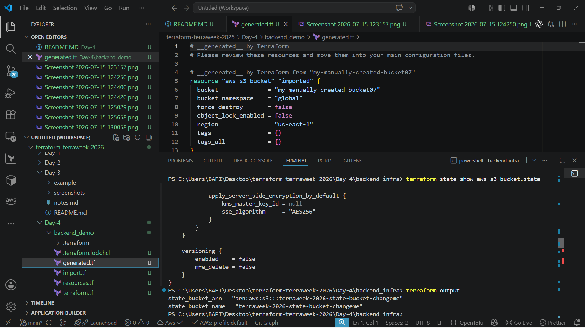
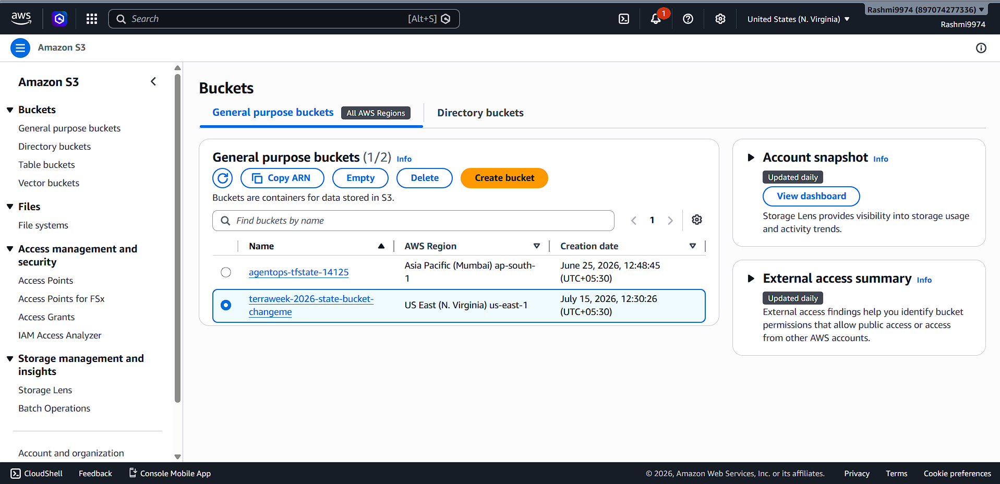
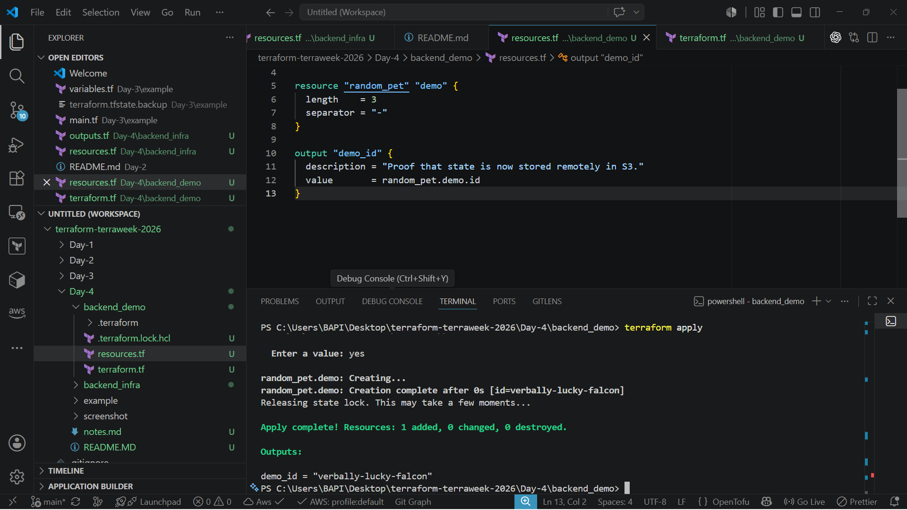
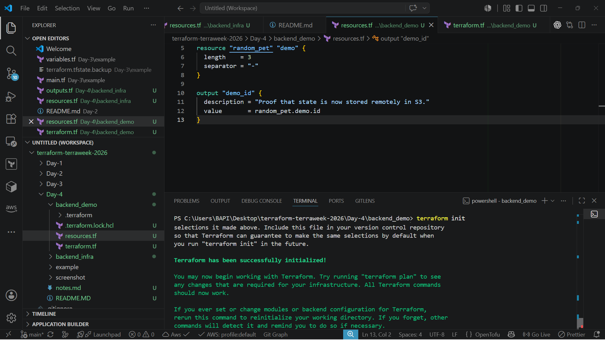
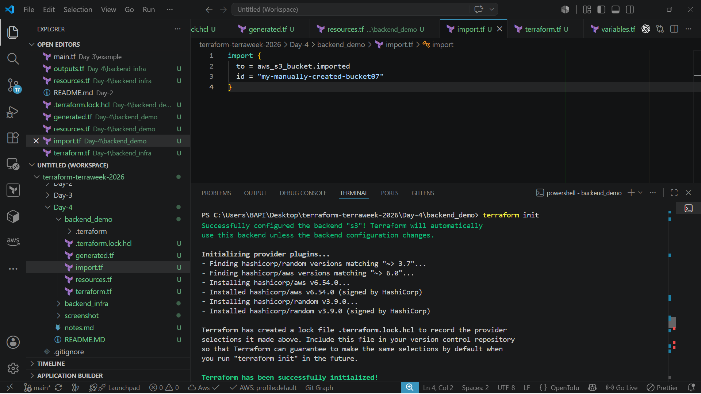
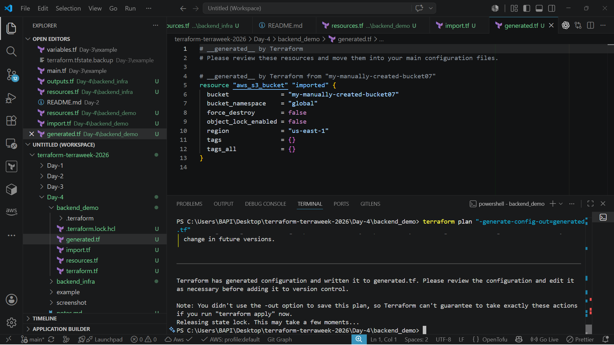
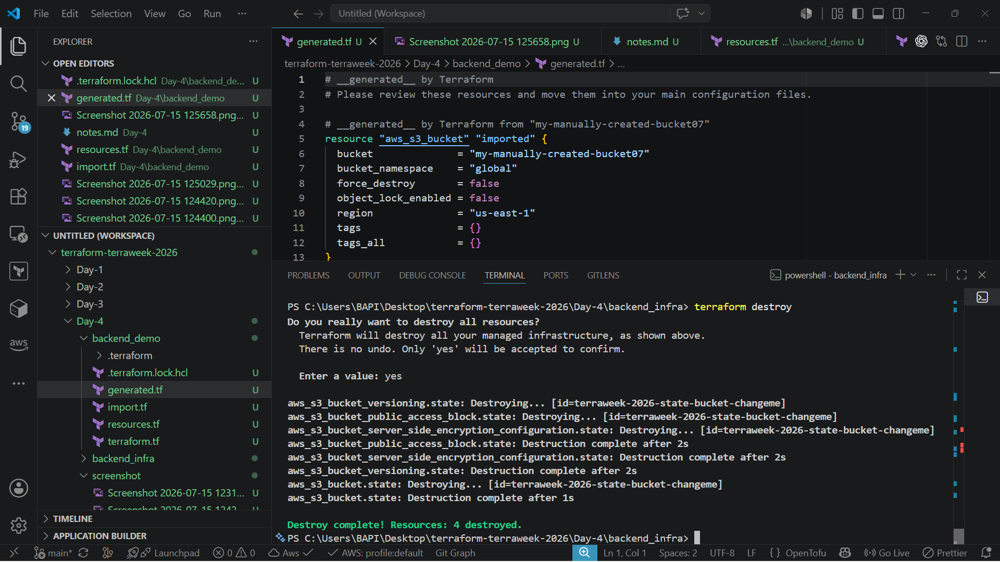

# Day 4 – Terraform State & Remote Backends

**TerraWeek Challenge 2026** · Organized by TrainWithShubham

[](https://www.terraform.io/)
[](https://aws.amazon.com/)
[]()

---

## 📌 Project Overview

Day 4 of the TerraWeek Challenge moves beyond writing individual resource blocks and into how Terraform actually tracks and manages infrastructure over time — through **state**. This module covers what the state file is, why it needs to be handled carefully, and how to move from a local, single-machine state file to a **production-style remote backend** using Amazon S3.

A key part of this day is implementing **native S3 state locking**, available in Terraform 1.11+:

```hcl
terraform {
  backend "s3" {
    bucket       = "terraweek-day4-state-bucket"
    key          = "backend_demo/terraform.tfstate"
    region       = "ap-south-1"
    encrypt      = true
    use_lockfile = true
  }
}
```

`use_lockfile = true` enables S3 to handle state locking natively, without requiring a separate DynamoDB table. DynamoDB-based locking is now considered a legacy pattern for new Terraform projects — it still works, but native S3 locking is the simpler, recommended approach going forward.

This module also covers **importing existing AWS infrastructure** into Terraform management using import blocks, which is a critical real-world skill for any team adopting Infrastructure as Code on top of resources that already exist.

---

## 🎯 Learning Objectives

- [x] Understand what Terraform State is and why it matters
- [x] Identify and resolve State Drift
- [x] Understand State Security risks and mitigations
- [x] Work with Local State
- [x] Migrate to Remote State
- [x] Configure an S3 Backend
- [x] Implement Native State Locking (`use_lockfile`)
- [x] Import Existing Resources using Import Blocks
- [x] Bootstrap Backend Infrastructure correctly

---

## 📂 Project Structure

```text
Day-4/
│
├── README.md
├── notes.md
├── backend_infra/
│   ├── provider.tf
│   ├── main.tf          # S3 bucket, versioning, encryption
│   └── outputs.tf
│
├── backend_demo/
│   ├── provider.tf       # backend "s3" configuration
│   ├── network.tf
│   ├── ec2.tf
│   └── generated.tf      # auto-generated from import
│
└── screenshots/
```

> Adjust file names above if your actual project layout differs — the structure reflects two intentionally separate configurations: `backend_infra` (bootstraps the S3 bucket) and `backend_demo` (the real infrastructure using that bucket as its backend).

---

## 🧾 Terraform State Commands

| Command | Purpose |
|---|---|
| `terraform state list` | Lists every resource currently tracked in the state file |
| `terraform state show <address>` | Displays the full attribute detail of a single tracked resource |
| `terraform state mv <src> <dest>` | Renames or moves a resource within state without touching real infrastructure |
| `terraform state rm <address>` | Stops Terraform from tracking a resource — does **not** delete the actual infrastructure |
| `terraform show` | Prints a human-readable summary of the entire current state |

---

## 🏗️ Backend Infrastructure

Before Terraform can store state remotely in S3, that S3 bucket has to already exist — Terraform can't configure a backend pointing at infrastructure that hasn't been created yet. This is the classic **bootstrapping problem** with remote backends.

To solve it, `backend_infra` is a small, standalone Terraform configuration whose only job is to create the backend resources. It intentionally uses **local state**, since this configuration is applied once and rarely touched again afterward.

**S3 Bucket** – the dedicated bucket that will hold `terraform.tfstate` for other projects (like `backend_demo`).

**Versioning** – enabled on the bucket so every update to the state file is preserved as a separate version. If state ever becomes corrupted or an unexpected change is applied, an earlier version can be restored instead of losing state entirely.

**Encryption** – server-side encryption is enabled so state — which can contain sensitive values in plaintext — is encrypted at rest inside the bucket.

---

## 🔄 Remote Backend

**Local State** – by default, Terraform stores `terraform.tfstate` directly on the machine where `apply` was run. This works for solo, single-machine projects, but breaks down immediately for teams — no shared source of truth, no locking, no protection against multiple people applying at once.

**Remote State** – moves that same state file into a shared location (S3, in this case) so every team member and every CI/CD pipeline reads and writes to the exact same state, instead of maintaining separate local copies.

**State Migration** – adding a `backend "s3"` block to an existing project and re-running `terraform init` prompts Terraform to detect the existing local state and offer to copy it into the new backend automatically.

**Native S3 Locking** – previously, safely allowing only one `apply` to run at a time required pairing S3 with a separate DynamoDB table dedicated to locks. Terraform 1.11+ removes that requirement entirely.

**`use_lockfile`** – setting this to `true` in the backend block tells Terraform to manage locking natively through a lock object inside the same S3 bucket, avoiding the extra DynamoDB dependency altogether.

### Architecture

```text
Developer
     │
terraform apply
     │
     ▼
Terraform Backend
     │
     ▼
Amazon S3
(terraform.tfstate)
     │
     ▼
Native Lock File (.tflock)
```

When `apply` runs, Terraform communicates with the configured backend, reads and writes the state object stored in S3, and creates a temporary native lock file for the duration of the operation — preventing a second concurrent `apply` from running against the same state until the lock clears.

---

## 📥 Import Existing Resources

Real infrastructure is rarely built entirely through Terraform from day one. Import support exists for bringing already-existing, manually-created resources under Terraform management **without destroying and recreating them**.

**Import Blocks** – Terraform 1.5+ introduced declarative import blocks that live directly inside `.tf` code, replacing the older one-off `terraform import` CLI command:

```hcl
import {
  to = aws_s3_bucket.existing_bucket
  id = "manually-created-bucket-name"
}
```

Because the import is written as code, it's version-controlled and visible to the whole team, rather than being a command someone ran once on their own machine.

**`-generate-config-out`** – Terraform can generate the matching resource configuration automatically based on the real attributes of the existing resource:

```bash
terraform plan -generate-config-out=generated.tf
```

**`generated.tf`** – the file Terraform produces, containing a resource block that reflects the actual current configuration of the imported resource.

**Reviewing generated configuration** – generated code should always be reviewed before being treated as final. It's a strong starting point, not a guaranteed clean result — attributes may need renaming, reordering, or trimming to match project conventions before it's merged into the main configuration.

---

## 🧹 Cleanup

Destroy order matters when a backend bucket is involved:

1. **Destroy `backend_demo` first** — this removes the actual EC2/networking resources whose state currently lives inside the S3 bucket.
2. **Destroy `backend_infra` second** — this removes the S3 bucket itself, only safe to do once nothing else depends on it as a backend.
3. **Empty versioned S3 buckets** if necessary — a bucket with versioning enabled retains historical object versions, which can block a clean `terraform destroy` until all versions are removed first.

---

## ✅ Best Practices Learned

- Never commit `terraform.tfstate` to Git.
- Never manually edit the state file — use `terraform state` commands instead.
- Encrypt remote state at rest.
- Enable bucket versioning on the state backend for recovery.
- Use native S3 locking (`use_lockfile = true`) instead of maintaining a separate DynamoDB table.
- Always review auto-generated configuration (`generated.tf`) before adopting it.
- Use remote state for any project involving more than one person.
- Destroy dependent configurations before destroying the backend they rely on.

---

## 🖼️ Screenshots

> Screenshots captured from my own terminal and AWS console while completing each task.

<!--  -->








---

## 💬 Day 4 Interview Questions

1. **What is Terraform state?**
   A file that records the real infrastructure Terraform has created and manages, used to compare against configuration on every plan/apply.

2. **What is state drift?**
   A mismatch between what the state file records and what actually exists in the real cloud environment.

3. **How does `terraform plan` relate to drift?**
   It checks real infrastructure against the state file and reports any differences before making changes.

4. **What does `terraform refresh` do?**
   Updates the state file to match real infrastructure, without modifying any actual resources.

5. **Why is state considered sensitive?**
   It can contain resource attribute values in plaintext, including secrets, even when those values are marked sensitive in CLI output.

6. **What's the risk of local state on a team project?**
   Each person has their own separate copy, leading to conflicts, stale data, and no locking against concurrent changes.

7. **What is a remote backend?**
   A shared storage location (like S3) where Terraform state is stored and accessed by everyone working on a project.

8. **Why must the S3 backend bucket be created before it's used as a backend?**
   Terraform cannot configure a backend pointing at a resource that doesn't exist yet — the bucket must be bootstrapped separately first.

9. **Why does the bootstrap configuration use local state?**
   Because it's the very configuration creating the remote backend, so it can't depend on a backend that doesn't exist at that point.

10. **What happens during `terraform init` when a new backend is added?**
    Terraform detects the existing local state and offers to migrate it into the newly configured backend.

11. **What does `use_lockfile = true` do?**
    Enables Terraform to use S3's native locking mechanism, removing the need for a separate DynamoDB lock table.

12. **Is DynamoDB locking still required in modern Terraform?**
    No — it's considered legacy for new projects now that native S3 locking is available in Terraform 1.11+.

13. **What is the purpose of state locking?**
    Prevents two operations from modifying the same state simultaneously, which could corrupt it.

14. **What does `terraform state list` show?**
    Every resource currently tracked in the state file.

15. **What's the difference between `terraform state rm` and deleting a resource block then applying?**
    `state rm` only stops Terraform from tracking the resource — it stays alive in the cloud. Removing the block and applying actually destroys it.

16. **What is an import block used for?**
    Bringing an existing, manually-created resource under Terraform management without destroying and recreating it.

17. **Why did Terraform move from CLI `import` to import blocks?**
    So imports are defined as version-controlled code rather than one-off, untracked commands.

18. **What does `-generate-config-out` do?**
    Automatically generates a Terraform resource configuration file based on the current real attributes of an imported resource.

19. **Should generated configuration be trusted as-is?**
    No — it should always be reviewed and cleaned up before being adopted as the final configuration.

20. **Why enable versioning on a state bucket?**
    So earlier versions of the state file can be recovered if the current state becomes corrupted or incorrect.

---

## 🧠 Key Learnings

- State is what allows Terraform to know what already exists before deciding what to change.
- Drift happens whenever real infrastructure changes outside of Terraform's awareness.
- `plan` detects drift; `refresh` updates state to match reality without altering real resources.
- State can hold secrets in plaintext, making its storage and access control genuinely important.
- Local state doesn't scale past a single person working alone.
- Backend infrastructure has to be bootstrapped with its own local state before anything else can use it remotely.
- Versioning and encryption on the state bucket are baseline requirements, not optional extras.
- `terraform init` handles state migration to a new backend with a simple confirmation prompt.
- Native S3 locking (`use_lockfile`) removes the need for a separate DynamoDB table for most new projects.
- Remote state with locking is what actually prevents team members from corrupting each other's infrastructure changes.
- `terraform state` subcommands allow safe inspection and reorganization of state without touching real infrastructure.
- Import blocks bring pre-existing infrastructure under Terraform control safely and declaratively.
- `-generate-config-out` accelerates imports significantly but still requires manual review.
- Cleanup order matters: dependent configurations must be destroyed before the backend infrastructure they rely on.

---

## 🏁 Conclusion

Day 4 of the TerraWeek Challenge shifted focus from simply writing Terraform configuration to understanding how Terraform actually keeps track of infrastructure over time. Working through state drift, state security, and the bootstrapping problem behind remote backends made clear why production teams treat state management as a first-class concern rather than an afterthought.

Implementing a real S3 backend with native state locking demonstrated exactly how teams safely collaborate on shared infrastructure without stepping on each other's changes, while importing pre-existing resources highlighted a practical, real-world scenario every DevOps engineer eventually faces — adopting Infrastructure as Code on top of infrastructure that already exists. Together, these exercises built a solid, production-oriented understanding of Terraform state heading into the rest of the TerraWeek Challenge.

---

*Part of the [TerraWeek Challenge 2026](https://github.com/rashmiranjanDevOps/terraform-terraweek-2026.git) by Rashmiranjan — Day 4 of 7.*