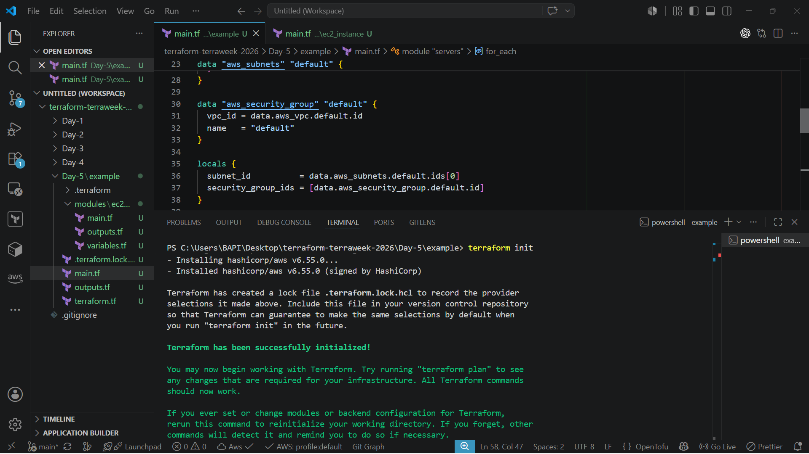
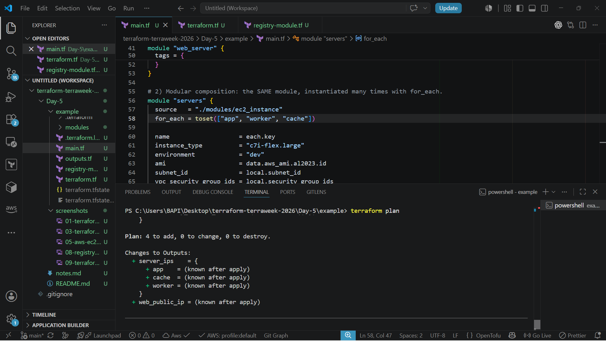
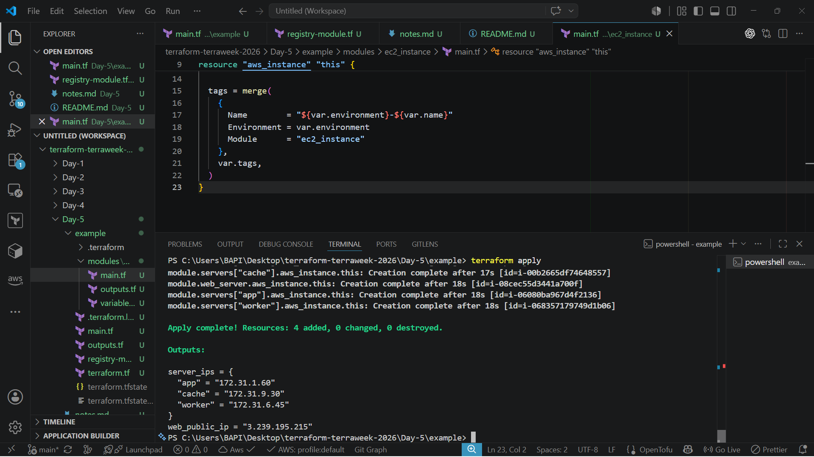
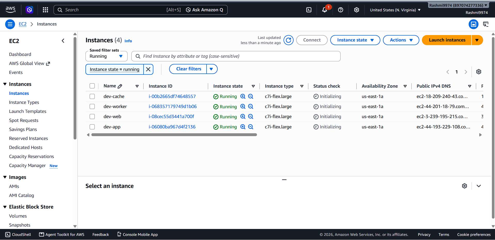
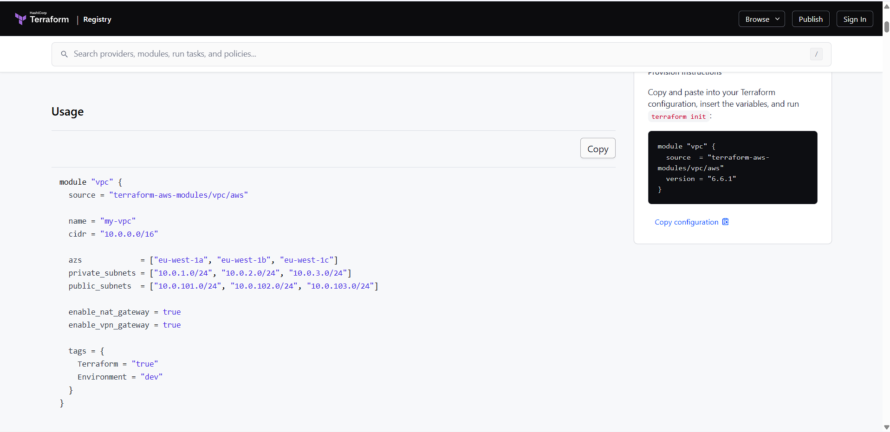
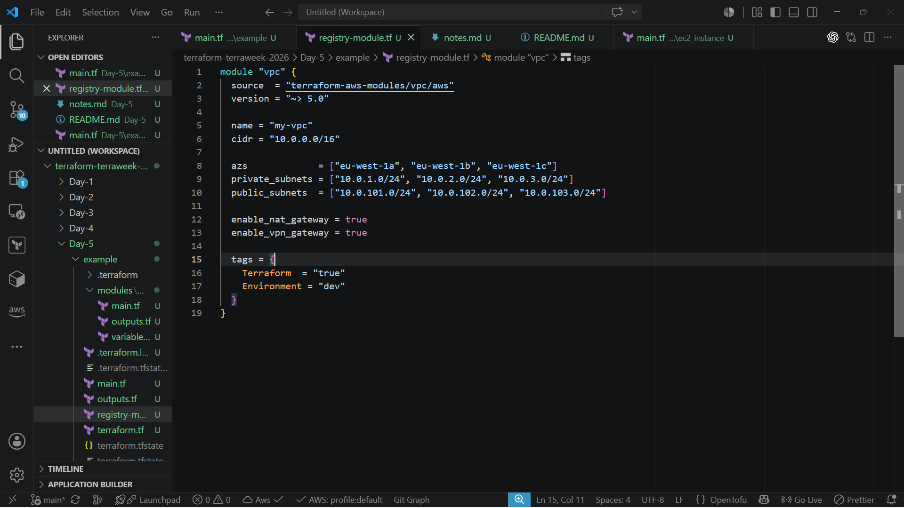
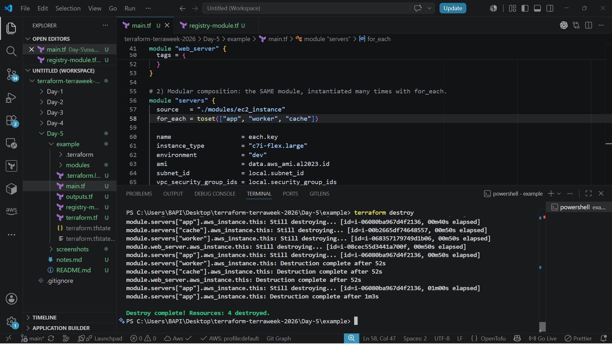

# Day 5 – Terraform Modules: Reusable, Composable Infrastructure

**TerraWeek Challenge 2026** · Organized by TrainWithShubham

[](https://www.terraform.io/)
[](https://aws.amazon.com/)
[]()
[]()

---

## 📌 Project Overview

Day 5 of the TerraWeek Challenge shifts from writing individual resource blocks to building **reusable, composable infrastructure** using Terraform Modules. Up to this point, each day's project has grown by adding more resources directly into the configuration — which works fine for a single environment, but doesn't scale well once the same infrastructure needs to exist in multiple places with slightly different settings.

A **Terraform Module** is a self-contained folder of `.tf` files that encapsulates a specific piece of infrastructure logic and accepts inputs to customize its behavior. Copy-pasting the same resource block across a project (or across projects) means every bug fix, every security update, and every configuration change has to be repeated manually everywhere that code was duplicated — a fragile and error-prone way to manage infrastructure at any real scale.

Modules solve this by letting infrastructure logic be written once and reused wherever it's needed, with each usage customized only through explicit inputs. This is why modules are considered the backbone of scalable Infrastructure as Code — they're what makes it possible for a team to manage dozens or hundreds of environments consistently, without every engineer reinventing the same VPC or EC2 setup from scratch.

This project demonstrates that idea in practice: a custom `ec2_instance` module built from scratch, reused multiple times through module composition, and compared against how the wider Terraform ecosystem consumes public Registry Modules. Together, these exercises reflect exactly how production teams structure real Terraform codebases.

---

## 🎯 Learning Objectives

- [x] Understand the Root Module
- [x] Understand Child Modules
- [x] Build and use a Local Module
- [x] Consume a Registry Module
- [x] Define Module Inputs
- [x] Define Module Outputs
- [x] Apply Module Composition
- [x] Demonstrate Reusability across multiple resources
- [x] Use `for_each` with Modules
- [x] Apply Version Pinning to modules
- [x] Understand Git Modules

---

## 📂 Project Structure

```text
Day-5/
│
├── README.md
├── notes.md
│
├── example/
│   ├── main.tf              # root module — calls the local ec2_instance module
│   ├── provider.tf          # required_version, required_providers, provider config
│   ├── outputs.tf           # root-level outputs (instance IDs, IPs)
│   ├── registry-module.tf   # registry module reference (VPC), not applied
│   └── ...
│
└── modules/
    └── ec2_instance/
        ├── main.tf           # resource logic for the EC2 instance
        ├── variables.tf      # module input definitions
        ├── outputs.tf        # module output definitions
        └── README.md         # module-level documentation
```

> Adjust the tree above if your actual file names differ slightly — the structure reflects the core separation this project demonstrates: a **root module** (`example/`) that consumes a **local child module** (`modules/ec2_instance/`).

---

## 🏗️ Architecture

**Local module flow:**

```text
Developer
   │
   ▼
Root Module
   │
   ▼
Local Module (ec2_instance)
   │
   ▼
AWS EC2 Instance
```

**Registry module flow:**

```text
Developer
   │
   ▼
Root Module
   │
   ▼
Terraform Registry
   │
   ▼
AWS VPC Module
```

The local flow reflects the custom `ec2_instance` module built and applied in this project. The registry flow reflects how a community-maintained module (like `terraform-aws-modules/vpc/aws`) is referenced and downloaded from the public Terraform Registry — used here for study purposes, not applied against real infrastructure.

---

## ⚖️ Root Module vs Child Module

| Feature | Root Module | Child Module |
|---|---|---|
| **Responsibility** | Orchestrates the overall infrastructure; decides what gets built and where | Encapsulates one focused piece of infrastructure logic |
| **Inputs** | Receives no inputs — it's the entry point | Receives inputs explicitly via `variables.tf` |
| **Outputs** | Can expose final outputs to the operator running `apply` | Returns outputs back to whichever module called it |
| **Execution** | Where `terraform init`, `plan`, and `apply` are actually run | Never run directly — only invoked through a `module` block |
| **Reusability** | Typically specific to one environment or project | Designed to be reused across multiple environments or projects |

---

## 🧱 Building My Own Module

A local module was built at `modules/ec2_instance/` to encapsulate the logic for provisioning a single EC2 instance, independent of any specific project's networking details.

**`main.tf`** — contains the actual `aws_instance` resource block, written generically so it has no knowledge of which VPC, subnet, or AMI it's being used with.

**`variables.tf`** — defines every input the module accepts:

```hcl
variable "instance_name" {
  description = "Name/tag for the EC2 instance"
  type        = string
}

variable "instance_type" {
  description = "EC2 instance size"
  type        = string
  default     = "t2.micro"
}

variable "ami_id" {
  description = "AMI ID to launch the instance from"
  type        = string
}

variable "subnet_id" {
  description = "Subnet where the instance will be launched"
  type        = string
}

variable "sg_id" {
  description = "Security group attached to the instance"
  type        = string
}
```

**`outputs.tf`** — returns useful values back to the caller:

```hcl
output "instance_id" {
  value = aws_instance.this.id
}

output "public_ip" {
  value = aws_instance.this.public_ip
}
```

**Passing values from the root module:**

```hcl
module "web" {
  source        = "../modules/ec2_instance"
  instance_name = "web-server"
  instance_type = "t2.micro"
  subnet_id     = aws_subnet.public.id
  sg_id         = aws_security_group.web_sg.id
  ami_id        = data.aws_ami.amazon_linux.id
}
```

**Why IDs are passed instead of performing lookups inside the module**

The module deliberately does not include its own `data "aws_ami"` or `data "aws_vpc"` lookups. If it did, every caller of the module would be forced into whatever lookup logic the module author decided on, with no flexibility. Instead, the root module — which already has full context about the environment — performs any necessary lookups and passes the resulting IDs in as plain inputs. This keeps the module flexible and predictable rather than making silent decisions on the caller's behalf.

**Why this matters for reusability**

Because the module accepts everything project-specific as an input, it can be called from any root module, in any environment, with any networking setup, without ever needing to modify the module's internal code. A single well-built module can serve dozens of use cases this way.

---

## 🔁 Module Composition

**Module Composition** means calling the same module multiple times to produce multiple similar — but independently configured — pieces of infrastructure, instead of duplicating the module's internal logic.

```hcl
module "servers" {
  source   = "../modules/ec2_instance"
  for_each = toset(["app", "worker", "cache"])

  instance_name = each.key
  instance_type = "t2.micro"
  subnet_id     = aws_subnet.public.id
  sg_id         = aws_security_group.web_sg.id
  ami_id        = data.aws_ami.amazon_linux.id
}
```

Combined with the `web` instance created earlier through a direct module call, this project provisions four EC2 instances — **web, app, worker, cache** — from a single reusable module definition.

**Why `for_each` is preferred over `count` for named infrastructure**

`count` identifies each created instance by a numeric index (0, 1, 2…). Removing an item from the middle of the list shifts every index after it, which can cause Terraform to unnecessarily destroy and recreate resources that didn't actually need to change. `for_each` identifies each instance by a stable, named key instead — removing `"worker"` only affects the worker instance, leaving `app` and `cache` completely untouched. For infrastructure with distinct, meaningful names, `for_each` is the safer and more predictable choice.

---

## 🌐 Local Modules vs Registry Modules vs Git Modules

| | Local Module | Registry Module | Git Module |
|---|---|---|---|
| **Source** | Relative filesystem path (`../modules/ec2_instance`) | Namespace pattern (`namespace/name/provider`) | Direct git repository URL |
| **Usage** | Best for project-specific or team-internal logic | Best for well-established, widely-used infrastructure patterns | Best for private/internal modules not published to a registry |
| **Advantages** | Full control, no external dependency, fast iteration | Community-tested, versioned, actively maintained | Works for private repos, supports exact tag/commit pinning |
| **Best Use Cases** | Custom internal building blocks (e.g. this `ec2_instance` module) | Complex, standardized infra like VPCs, EKS clusters, IAM baselines | Internal company modules kept in private git repositories |

---

## 📦 Terraform Registry Module

The **Terraform Registry** is a public library of pre-built, versioned modules maintained by HashiCorp partners and the open-source community. Rather than writing something as complex as a production-grade multi-AZ VPC from scratch, teams commonly consume a well-tested registry module instead.

```hcl
module "vpc" {
  source  = "terraform-aws-modules/vpc/aws"
  version = "~> 5.0"
}
```

- **`source`** — for registry modules, this is not a file path but a namespace pattern (`namespace/module-name/provider`) that Terraform resolves automatically against the public registry during `terraform init`.
- **`version`** — pins the module to a compatible version range, exactly the same constraint syntax used for provider version pinning.
- **Version Pinning** — protects the project from a maintainer's future breaking change being silently pulled in during a routine `terraform init`.

This registry module was added to this project purely to demonstrate **how** registry modules are referenced and versioned — it was not applied, and it does not replace the hand-built infrastructure used elsewhere in this project.

---

## 🔒 Module Version Locking

| Method | Advantages | Disadvantages | Best Use Case |
|---|---|---|---|
| **`~> 5.0`** | Gets minor/patch updates automatically; balances safety and freshness | Still allows some unreviewed change within the minor line | Default choice for most teams |
| **`= 5.1.2`** | Maximum predictability — always the exact same version | No automatic bug fixes; requires manual bumps | Highly regulated or sensitive environments |
| **`>= 5.0, < 6.0`** | Full control over the exact allowed boundary | More verbose than `~>` for the same intent | Custom constraint ranges beyond standard pessimistic pinning |
| **Git Tag (`?ref=v1.2.0`)** | Human-readable, matches the module's own release process | Tags can technically be moved or deleted | Internal modules with a proper git tagging/release process |
| **Git Commit SHA (`?ref=<sha>`)** | Fully immutable — the most reproducible option available | Not human-readable; harder to track "what version is this" | Strict environments where exact reproducibility is mandatory |

**Why version pinning matters in production:** unpinned modules can change silently between one `terraform init` and the next, breaking a working configuration with zero code changes on the team's part. Pinning guarantees reproducible builds, protects against breaking changes introduced upstream, and keeps CI/CD pipelines behaving consistently run after run.

---

## ⚙️ Terraform Commands Used

| Command | Purpose |
|---|---|
| `terraform init` | Initializes the working directory, downloads providers, and registers both local and registry modules |
| `terraform validate` | Checks configuration syntax and module input types for correctness |
| `terraform plan` | Shows exactly what the root module and its child modules will create, change, or destroy |
| `terraform apply` | Provisions the actual infrastructure defined across the root and child modules |
| `terraform output` | Displays the outputs returned by the root module (which are sourced from the module outputs) |
| `terraform destroy` | Cleanly tears down every resource created through the root module and its module calls |

---

## ✅ Best Practices Learned

- Keep modules reusable — avoid hardcoding anything project-specific inside them.
- Keep modules small and focused on a single responsibility.
- Pass configuration into modules using variables, never assumptions.
- Return meaningful values from modules using outputs.
- Avoid duplicate data lookups inside modules — let the caller supply IDs instead.
- Keep modules independent of any one specific environment or project.
- Pin module versions, whether from a registry or a git source.
- Validate module inputs where possible to catch bad values early.
- Write a README for every reusable module, documenting its inputs, outputs, and usage.
- Never hardcode values that should reasonably vary between environments.
- Design modules so they can be reused safely across dev, staging, and production.

---

## 🖼️ Screenshots

> Screenshots captured from my own terminal and AWS console while completing each task.











---

## 💬 Interview Questions

1. **What is a Terraform module?**
   A self-contained folder of `.tf` files that encapsulates reusable infrastructure logic and accepts inputs to customize its behavior.

2. **What's the difference between a root module and a child module?**
   The root module is where `terraform apply` runs; child modules are invoked by the root (or by other modules) through a `module` block.

3. **Why is copy-pasting Terraform code considered a poor practice?**
   Because any fix or change then has to be manually repeated across every duplicated copy, increasing the risk of inconsistency and missed updates.

4. **What is a Registry Module?**
   A pre-built, versioned module published to the Terraform Registry, referenced by a namespace pattern rather than a file path.

5. **What is a Git Module?**
   A module sourced directly from a git repository URL, commonly used for private or internal modules not published to any registry.

6. **How does a module receive configuration from its caller?**
   Through input variables defined in the module's `variables.tf`.

7. **How does a module return data to its caller?**
   Through outputs defined in the module's `outputs.tf`.

8. **Why should a module avoid performing its own data source lookups?**
   Doing so removes flexibility from the caller and forces every user into the same internal decision; passing IDs in as inputs is more flexible.

9. **What does `terraform init` do differently when local modules are involved?**
   It registers and prepares local modules in addition to downloading and initializing providers.

10. **What is Module Composition?**
    Calling the same module multiple times, typically with `for_each`, to create multiple similar but independently configured pieces of infrastructure.

11. **What does `each.key` represent inside a `for_each` module block?**
    The current item from the set or map being iterated over in that pass.

12. **Why is `for_each` preferred over `count` for named infrastructure?**
    Removing a named key only affects that specific instance, while removing an item under `count` can shift indexes and trigger unnecessary recreation of unrelated resources.

13. **What's the difference between a local module and a registry module?**
    A local module is referenced by a relative filesystem path; a registry module is referenced by a namespace pattern and pulled from the Terraform Registry.

14. **Why is version pinning important for modules?**
    It ensures reproducible builds and prevents an unrelated `terraform init` from silently pulling in a breaking upstream change.

15. **What does `~> 5.0` mean when pinning a module version?**
    It allows updates within the 5.x line (5.1, 5.9, etc.) but blocks a jump to the next major version, 6.0.

16. **What is the most strict way to pin a git-sourced module?**
    Pinning to an exact commit SHA, since it's immutable — unlike a tag, which can be moved or deleted later.

17. **What is the benefit of module encapsulation?**
    Callers only need to know a module's inputs and outputs, not its internal implementation details.

18. **How can one module's output be used by another module?**
    By referencing it directly as an input, such as `module.vpc.subnet_id` passed into another module's `subnet_id` variable.

19. **Why should modules be kept small and focused on one responsibility?**
    Smaller, focused modules are easier to test, reuse, and reason about than large, tangled configurations.

20. **What role do modules play in CI/CD consistency?**
    Pinned, well-structured modules ensure pipelines produce the same infrastructure outcome on every run, rather than drifting based on whatever module version happens to be latest at execution time.

---

## 🧠 Key Learnings

- Modules turn repeated, duplicated Terraform code into a single, reusable, testable unit.
- A root module orchestrates infrastructure; child modules encapsulate focused, reusable logic.
- Modules should stay flexible by accepting configuration through variables rather than hardcoding assumptions.
- Outputs are how a module communicates useful results back to whatever called it.
- Avoiding internal data lookups inside a module keeps it reusable across different environments and contexts.
- `terraform init` initializes local modules just as it does providers — confirmed directly by observing its output.
- Resources created through a module appear namespaced in plan and state output (e.g. `module.web.aws_instance.this`).
- Module composition with `for_each` allows one module definition to produce multiple named, independently managed instances.
- `for_each` is safer than `count` for modules because it avoids index-shifting side effects when instances are added or removed.
- The Terraform Registry provides community and vendor-maintained modules for common, complex infrastructure patterns.
- Registry modules are referenced by namespace, not by file path, and resolved automatically during init.
- Local, Registry, and Git modules differ only in where their source code comes from — the calling syntax stays conceptually similar.
- Version pinning applies to modules the same way it applies to providers: `~>`, exact versions, ranges, tags, or commit SHAs.
- Commit SHA pinning is the most immutable option, useful where absolute reproducibility is required.
- Reproducible builds, protection from breaking changes, and CI/CD stability are the core reasons production teams pin module versions.
- Passing one module's output into another module's input is the standard pattern for composing larger, multi-layered infrastructure.
- Well-documented modules (with a clear README, inputs, and outputs) are far easier for teams to adopt and trust.
- Keeping each module focused on a single responsibility makes testing, reuse, and debugging significantly easier.

---

## 🏁 Conclusion

Day 5 of the TerraWeek Challenge marked a real shift in how this project's Terraform code is structured — moving away from repeated, hand-written resource blocks and toward reusable, composable Infrastructure as Code built around modules. Designing the `ec2_instance` module to accept explicit inputs rather than making internal assumptions, then reusing it to provision four independently named EC2 instances through `for_each`, demonstrated exactly why modules are considered the backbone of scalable infrastructure management.

Understanding how the same principles extend to Registry and Git modules — complete with proper version pinning — rounds out a practical, production-oriented view of how real DevOps teams manage infrastructure at scale. Reusable modules directly improve **scalability**, **maintainability**, **reusability**, **consistency**, and **team collaboration**, turning what could easily become a sprawling, duplicated codebase into something structured, predictable, and genuinely built to grow.

---

⭐ Part of the **TerraWeek Challenge 2026** by Rashmiranjan — Day 5 of 7.